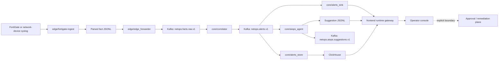
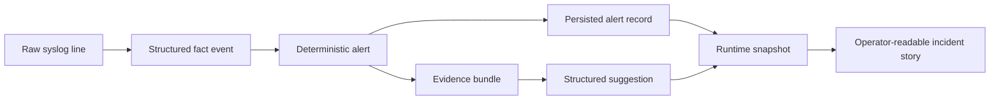

## Towards NetOps: Hybrid AIOps Platform for Network Awareness and Operator-Guided Remediation
[](./README.md) [](./README_CN.md)

> Hybrid AIOps Platform: Deterministic Streaming Core + CPU Local LLM (On-Demand) + Multi-Agent Orchestration

#### What This Repository Is Actually Building

This repository builds a NetOps / AIOps system around a strict engineering order of operations:

1. raw device logs must first become structured, replayable facts
2. first-pass detection must remain deterministic and traceable
3. alert persistence and hot retrieval must be stable before augmentation is trusted
4. model-driven reasoning is allowed only after an alert contract already exists
5. the operator surface must explain the chain honestly instead of pretending execution is already safe

That order is the whole point of the architecture.
The repository is not trying to prove that an LLM can say something plausible about network logs.
It is trying to prove that a real network runtime can be turned into a stable data plane, and that bounded AIOps can then attach useful explanation and next-step guidance without damaging the realtime path.

## System Topology



At a glance:

- `edge/fortigate-ingest` turns vendor syslog into structured facts with replay semantics
- `edge/edge_forwarder` moves those facts into the shared stream
- `core/correlator` decides whether a deterministic rule threshold has been crossed
- `core/alerts_sink` keeps an audit trail
- `core/alerts_store` keeps a queryable history surface
- `core/aiops_agent` turns alerts into evidence-backed suggestions
- `frontend/gateway` projects all of that into a read-only runtime console

## End-To-End Dataflow

The easiest way to understand the repository is to follow the object that moves through it.



The object changes meaning at each stage:

| Stage | Data object | Producer | Why this stage exists |
| --- | --- | --- | --- |
| Source | raw FortiGate syslog line | device / gateway | carries the original network event, but still in vendor-specific text form |
| Edge fact | structured JSONL fact | `edge/fortigate-ingest` | normalizes time, identity, source metadata, and replay semantics |
| Shared transport | Kafka fact record | `edge/edge_forwarder` | decouples edge file handling from core analytics |
| Alert | structured alert contract | `core/correlator` | makes the first system-level judgment on a deterministic rule path |
| Audit/query persistence | JSONL + ClickHouse alert record | `core/alerts_sink`, `core/alerts_store` | preserves evidence and enables recent-history lookup |
| Suggestion input | evidence bundle + context | `core/aiops_agent` | compresses alert, topology, device, and history context into a bounded inference object |
| Suggestion output | structured suggestion record | `core/aiops_agent` | turns an alert into operator-readable summary, confidence, hypotheses, and next actions |
| UI view | `RuntimeSnapshot` | `frontend/gateway` | presents the chain as a readable runtime story rather than loose telemetry fragments |

## What Data Is Produced And Why It Matters

### 1. Structured Fact Events

The edge layer is not just "tail a file and forward lines".
It has to create a fact object that downstream systems can trust.

Important fact-side responsibilities:

- preserve source provenance such as file path, inode, and offset
- normalize event time into a sortable `event_ts`
- derive a stable `src_device_key` for device-level grouping
- retain a compact `kv_subset` so parser evolution does not force every investigation back to the raw file

The full field tables are in:

- [FortiGate input field analysis](./documentation/FORTIGATE_INPUT_FIELD_ANALYSIS.md)
- [FortiGate parsed JSONL output sample](./documentation/FORTIGATE_PARSED_OUTPUT_SAMPLE.md)

### 2. Deterministic Alerts

The alert object is the repository's first real incident contract.
It is where "there was traffic" becomes "the system has determined something crossed policy or threshold".

A current mounted-runtime alert sample looks like this:

```json
{
  "alert_id": "2081f46a5146d642d4110253926698c1b8b6fced",
  "alert_ts": "2026-03-26T18:56:04+00:00",
  "rule_id": "deny_burst_v1",
  "severity": "warning",
  "metrics": { "deny_count": 321, "window_sec": 60, "threshold": 200 },
  "event_excerpt": {
    "action": "deny",
    "srcip": "5.188.206.46",
    "dstip": "77.236.99.125",
    "service": "tcp/3472"
  },
  "topology_context": {
    "service": "tcp/3472",
    "srcintf": "wan1",
    "dstintf": "unknown0",
    "zone": "wan"
  }
}
```

Why this matters:

- `metrics` tells you exactly why the rule fired
- `event_excerpt` preserves the local incident shape
- `topology_context`, `device_profile`, and `change_context` turn a raw rule hit into something that can be localized and investigated

### 3. Persisted Alert Products

The same alert is stored twice because the two jobs are different.

| Product | Path / system | Why it exists |
| --- | --- | --- |
| Alert JSONL | `/data/netops-runtime/alerts/alerts-*.jsonl` | audit trail, replay, exact emitted record retention |
| Alert table rows | ClickHouse via `core/alerts_store` | recent-history retrieval, similar-alert lookup, context assembly |

This dual storage is not duplication by accident.
JSONL is the evidence surface.
ClickHouse is the retrieval surface.

### 4. Structured Suggestions

Suggestions are not free-form chat outputs.
They are structured runtime products emitted after the system has already established that an alert exists.

A current mounted-runtime suggestion sample looks like this:

```json
{
  "suggestion_id": "598b2edba0f164f9a0048e8d6021974123d1927c",
  "suggestion_ts": "2026-03-31T15:35:49.119215+00:00",
  "suggestion_scope": "alert",
  "alert_id": "2081f46a5146d642d4110253926698c1b8b6fced",
  "rule_id": "deny_burst_v1",
  "priority": "P2",
  "summary": "deny_burst_v1 triggered for service=tcp/3472 device=5.188.206.46",
  "context": {
    "service": "tcp/3472",
    "src_device_key": "5.188.206.46",
    "recent_similar_1h": 0,
    "provider": "template"
  }
}
```

Why this matters:

- the output already points back to a specific alert
- the suggestion remains bounded to alert context instead of pretending to replace the detection path
- the operator gets summary, priority, hypotheses, and recommended actions in a stable schema

## How The Components Connect

The repository is easiest to reason about if we explain each component in relation to the next one it feeds.

### Edge Layer

#### `edge/fortigate-ingest`

This is the boundary between messy device reality and reusable system facts.

It is responsible for:

- scanning active and rotated FortiGate log files
- preserving checkpoint and replay semantics
- parsing syslog + FortiGate key-value payload
- writing parsed facts as JSONL
- keeping enough provenance for later audit and failure recovery

It does not decide whether an incident exists.
It only decides whether the raw line can be converted into a stable fact object.

#### `edge/edge_forwarder`

This component exists to separate file semantics from transport semantics.

It:

- reads parsed JSONL facts
- forwards them into `netops.facts.raw.v1`
- preserves event meaning rather than reinterpreting it

Without this separation, core analytics would inherit edge-local file handling logic.

### Core Layer

#### `core/correlator`

This is the realtime decision point.

It:

- consumes structured facts from `netops.facts.raw.v1`
- applies quality gates
- runs deterministic rules and sliding windows
- emits `netops.alerts.v1`

This is the most important architectural line in the repository:
the first judgment that "this is now an alert" stays deterministic.
That is why the system can still be replayed, audited, and tuned at the rule level.

#### `core/alerts_sink`

This is the long audit memory of the alert stream.

It:

- consumes `netops.alerts.v1`
- writes hourly JSONL
- preserves emitted alerts as they actually appeared at runtime

This is what lets the repository talk about alert history without depending only on dashboards or mutable query results.

#### `core/alerts_store`

This is the hot retrieval surface.

It:

- consumes `netops.alerts.v1`
- stores structured alert rows in ClickHouse
- supports recent-similar lookups and history queries used by later stages

Without it, every history lookup would degrade into scanning files.

#### `core/aiops_agent`

This is the bounded augmentation layer.

It:

- consumes alerts, not raw logs
- assembles evidence bundles from alert payload, history, topology, device, and change context
- emits both alert-scope and cluster-scope suggestions
- persists suggestion JSONL for auditability

It does not replace the correlator.
It explains and extends the alert once the alert already exists.

### Frontend And Projection Layer

#### `frontend/gateway`

The gateway is a projection builder, not a system of record.

It:

- reads alert JSONL, suggestion JSONL, and deployment controls
- assembles a `RuntimeSnapshot`
- streams updates over `SSE`

This keeps the frontend honest: the UI reflects runtime artifacts instead of inventing a separate truth model.

#### `frontend`

The React console is process-oriented rather than panel-oriented.

It is meant to answer:

- where in the chain is the current incident shape visible
- what evidence is present or missing
- what did the system infer, and from which alert context
- where does explanation stop and control begin

The important thing is not just that the page renders.
It is that the page makes the system's boundary legible.

## Current Runtime Facts From Mounted Data

The facts below are derived from the currently mounted `/data/netops-runtime` data on this workspace.

| Runtime slice | Observed fact |
| --- | --- |
| Alert sink coverage | `554` hourly files, `152,481` alert records |
| Alert sink time range | `2026-03-04T15:09:11+00:00` to `2026-03-27T23:00:17+00:00` |
| Suggestion sink coverage | `480` hourly files |
| Suggestion sink time range | `2026-03-09T05:08:56.549849+00:00` to `2026-03-31T15:36:55.895982+00:00` |
| Latest 6 alert partitions | `504` alerts over `2026-03-27T18:00:14+00:00` to `2026-03-27T23:00:17+00:00` |
| Latest 6 suggestion partitions | `3,703` suggestions over `2026-03-31T10:00:16.165096+00:00` to `2026-03-31T15:36:55.895982+00:00` |
| Last 24 alert partitions | `warning=2067`, `critical=2` |
| Last 24 alert rules | `deny_burst_v1=2067`, `bytes_spike_v1=2` |
| Last 24 suggestion scopes | `alert=9058`, `cluster=1353` |
| Last 24 suggestion provider | `template=10411` |

One important honesty note:
the currently mounted runtime is not a perfectly time-aligned live snapshot across all layers.
The latest suggestion records still mostly reference March 26 alert context, while the latest mounted alert file stops on March 27.
That means the repository demonstrates continuous output products, but this particular mounted dataset should not be described as a perfectly synchronized live pipeline image.

## What The Final Products Mean For An Operator

By the time data reaches the console, the system has already turned a device log into four different levels of meaning:

| Product | Meaning to the operator |
| --- | --- |
| Raw-derived fact | "this event existed and can be traced back to source" |
| Deterministic alert | "the system can justify why this crossed a threshold or rule" |
| Evidence bundle | "the alert has enough topology, device, and history context to investigate" |
| Suggestion | "the system can summarize what likely matters next without pretending it has already executed anything" |

That is why the frontend keeps the remediation boundary explicit.
The system can already explain an incident path.
It does not yet claim a safe write-back path.

## Landed Scope And Explicit Boundary

What is landed:

- replay-aware FortiGate ingest
- structured fact forwarding into Kafka
- deterministic alerting
- alert audit JSONL
- ClickHouse-backed hot alert retrieval
- bounded alert-scope and cluster-scope suggestion emission
- read-only runtime console and thin gateway

What remains explicitly outside the current delivered path:

- device write-back
- approval-driven execution control
- automatic remediation
- full-stream model judgment
- any claim that the current UI is already a closed-loop control plane

## Verification Entry Points

```bash
python3 -m pytest -q tests/core
pytest -q tests/frontend/test_runtime_reader_snapshot.py tests/frontend/test_runtime_stream_delta.py
python3 -m compileall -q core edge frontend/gateway
python3 -m core.benchmark.live_runtime_check
cd frontend && npm run build
```

Current collected test baseline:

- `33` tests across `tests/core` plus the two runtime-console tests

## More Detailed Docs

- [Current project state](./documentation/PROJECT_STATE_EN.md)
- [Controlled validation log](./documentation/CONTROLLED_VALIDATION_20260322.md)
- [Frontend runtime architecture](./documentation/FRONTEND_RUNTIME_ARCHITECTURE_20260328_EN.md)
- [Edge runtime guide](./documentation/EDGE_RUNTIME_GUIDE.md)
- [Core runtime guide](./documentation/CORE_RUNTIME_GUIDE.md)
- [Frontend workspace guide](./documentation/FRONTEND_WORKSPACE_GUIDE.md)
- [FortiGate input field analysis](./documentation/FORTIGATE_INPUT_FIELD_ANALYSIS.md)
- [FortiGate parsed JSONL output sample](./documentation/FORTIGATE_PARSED_OUTPUT_SAMPLE.md)
- [FortiGate ingest field reference](./documentation/FORTIGATE_INGEST_FIELD_REFERENCE_EN.md)
