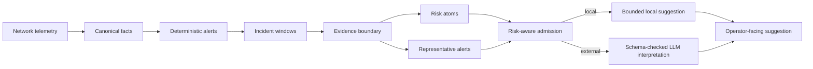
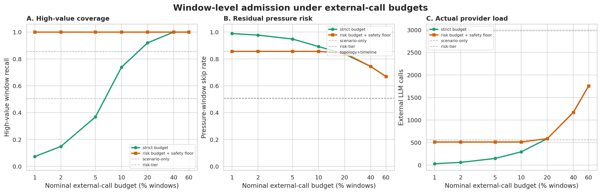
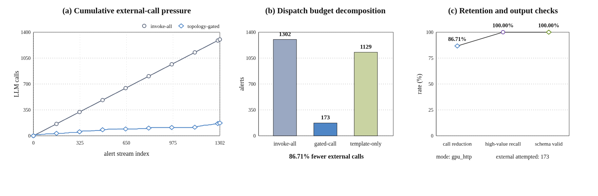
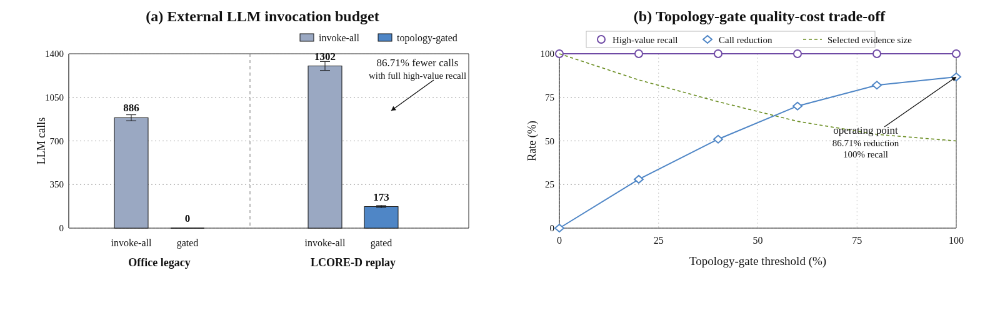
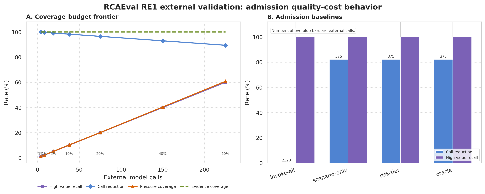

## AiCS: Risk-Aware Window-Level Admission for LLM-Assisted Network Operations

[](./README.md)
[](./README_CN.md)

**AiCS-NetopsDelimitation** is the repository for AiCS, a system that studies risk-aware LLM admission and context delimitation for deterministic NetOps alert streams. AiCS stands for **Admission-aware Incident Context Selection**. Delimitation means the system explicitly bounds which incident windows, representative alerts, and evidence views may cross into external model interpretation.

The system does not ask a model to decide whether an alert exists. Deterministic monitoring first produces confirmed alerts. The post-alert layer then groups those alerts into incident windows, builds a window-level evidence boundary, and decides whether external LLM interpretation is worth the cost and risk.

The current research question is:

> Given a fixed deterministic alert stream, which incident windows should enter external LLM analysis, which windows can remain local, and how much risk is introduced by reducing model calls?

This is an admission and context-boundary problem before LLM-based fault localization or root-cause analysis. It is not a full failure-localization system, it does not write to devices, and it does not claim that model explanations are diagnostically correct.

## What Changed in This Branch

The earlier alert-level topology gate has been lifted to a window-level admission layer. The new path treats repeated alerts as one operational unit instead of calling a model for every alert. The main added mechanisms are:

- **Incident windows.** Deterministic alerts are grouped by time window and path shape, while retaining device spread, scenario mix, recurrence, and topology pressure.
- **Self-healing-aware admission.** Transient and self-healing-looking alerts are not simply discarded. The system records whether they are single local transients, repeated transients, topology-pressure windows, or mixed with higher-value fault evidence.
- **Window-level evidence boundary.** Each window has selected, excluded, and missing evidence surfaces. The selected surface is what the model may see; excluded and missing surfaces stay visible for audit.
- **Risk atoms.** Window risk is represented as interpretable atoms such as high-value fault evidence, recurrence pressure, topology pressure, multi-device spread, downstream fanout, and missing evidence.
- **Representative alert selection.** A window may contain many alerts, but the external path receives only a small representative set that covers device, path, scenario, time, and pressure features.
- **Risk-aware budgeted admission.** The selector chooses windows by marginal uncovered risk per representative-alert cost. This produces a quality-cost frontier instead of a single call-reduction number.
- **Expert-style structural review.** A reproducible reviewer pass fills window-level labels from deterministic window fields, then calibrates risk weights to target false-skip rates. These labels are useful for engineering iteration, but they are not a substitute for independent operator labels.

## End-to-End Flow

The implemented path has six stages. Each stage has a specific role and does not rely on a model to establish alerts.

1. **Telemetry normalization.** LCORE-D router telemetry is converted into canonical facts with stable event identity, device fields, scenario labels, topology fields, and numeric metrics.
2. **Deterministic alerting.** The core alerting path validates facts and emits deterministic alerts. The LLM is not in the alert formation path.
3. **Window construction.** Alerts are grouped into incident windows using time and path shape. The window records alert count, devices, paths, scenario mixture, recurrence pressure, topology pressure, and downstream fanout.
4. **Evidence-boundary construction.** The window is converted into selected evidence, excluded evidence, and missing evidence. The local topology subgraph is used here to define device and path evidence, not as a standalone paper claim.
5. **Risk-aware admission.** Risk atoms and representative-alert cost drive the budget controller. The controller either keeps a window local or sends representative alerts and context views to the external provider.
6. **Suggestion publication.** Local windows receive bounded local suggestions. External windows receive schema-checked, advisory-only LLM output. Neither path performs device-side changes.



## Evidence Boundary

The evidence boundary is the object that connects deterministic alerts to optional model reasoning. It prevents two bad inputs: an under-contextualized single alert and an oversized dump of nearby telemetry.

| Surface | Contents | Role |
| --- | --- | --- |
| Selected evidence | Seed devices, path signatures, representative alerts, timeline cues, recurrence cues, topology subgraph cues | May be exposed to an external model |
| Excluded evidence | Local transient context, repeated non-primary alerts, weak context, topology noise nodes | Kept out of the model-facing view but retained for audit |
| Missing evidence | Unavailable neighbor signals, missing path signals, missing history signals, single-alert timeline gaps | Exposes what the system does not know |

The local topology subgraph remains active inside this boundary. It supplies seed device, path symptom, and noise-node cues. In the current window-level system, it is no longer the whole admission policy; it is one input to the evidence scope.

## Incident Window Labels

Windows are labeled by deterministic structure before model admission:

| Window label | Meaning | Default role |
| --- | --- | --- |
| `external_induced_fault` | The window contains high-value fault evidence | External candidate |
| `mixed_fault_and_transient` | The window mixes high-value and transient evidence | External candidate |
| `external_multi_device_spread` | Transient-looking alerts span multiple devices | External candidate |
| `external_repeated_transient` | Transient-looking alerts repeat inside the window | External candidate |
| `local_transient_with_pressure` | Transient-looking window has topology pressure but no stronger trigger | Local by default, reviewable |
| `local_single_transient` | Single low-pressure transient-looking window | Local |

These labels are admission labels, not root-cause labels. They answer whether a window is worth external interpretation, not which device caused the incident.

## Risk Atoms and Risk-Aware Admission

Window risk is not treated as an opaque score. The system first extracts risk atoms:

| Risk atom | Interpretation |
| --- | --- |
| `value:high_fault` | The window contains high-value fault evidence |
| `context:mixed_fault_transient` | High-value and transient evidence appear in the same window |
| `spread:multi_device` | The window spans multiple devices |
| `pressure:recurrence` | The window contains repeated alerts |
| `pressure:topology` | The window has path, downstream, or topology pressure |
| `impact:downstream_fanout` | The affected device has high downstream fanout |
| `scope:device`, `scope:path` | The selected window covers a device or path risk scope |
| `missing:*` | Required evidence is unavailable |

The budget controller selects windows by marginal uncovered risk per representative-alert cost:

```text
gain(w | S) = weight(risk_atoms(w) - covered_atoms(S))
priority(w) = gain(w | S) / representative_cost(w)
```

Two budget families are evaluated:

- **Strict coverage budget.** The selector obeys the external-call budget exactly. This exposes how much high-value coverage is lost when the budget is hard.
- **Risk budget with safety floor.** The selector keeps high-value windows eligible even if this exceeds the nominal budget. This exposes the extra cost needed to avoid high-value false skips.

## Context Engineering

External requests are not sent as one unstructured JSON dump. The post-alert path constructs fixed context views:

| Context view | Purpose |
| --- | --- |
| Alert view | Alert id, rule id, severity, scenario, metrics, and dimensions |
| Topology view | Seed device, path signature, hop fields, downstream dependents, local topology subgraph cues, window devices, and window paths |
| Timeline view | Window start/end, alert sequence, representative alerts, and window boundary |
| History view | Recent recurrence, cluster size, self-healing decision, window label, risk tier, and risk atoms |
| Missing-evidence view | Fields that are unavailable and should limit model certainty |
| Excluded-evidence view | Context explicitly kept out of the model-facing selected surface |
| Serving view | Local/external decision, risk tier, decision reason, and provider budget tier |

This structure is the practical context-engineering layer. It is simpler than a multi-agent RCA pipeline, but it gives AiCS-NetopsDelimitation a stable admission contract and keeps model calls auditable.

## Current LCORE-D Evaluation

The full LCORE-D replay contains:

| Quantity | Value |
| --- | ---: |
| Deterministic alerts | 6,700 |
| Sessionized incident windows | 2,283 |
| Average alerts per window | 2.935 |
| Pressure windows | 2,124 |
| Self-healing-dominant windows | 1,935 |
| Multi-device windows | 782 |
| High-value windows | 348 |

Window labels in the current replay:

| Label | Windows |
| --- | ---: |
| `external_induced_fault` | 154 |
| `mixed_fault_and_transient` | 194 |
| `external_multi_device_spread` | 697 |
| `external_repeated_transient` | 238 |
| `local_transient_with_pressure` | 851 |
| `local_single_transient` | 149 |

Policy comparison on the full replay:

| Policy | External calls | Call reduction | Selected windows | Window reduction | High-value window recall | Pressure-window skip rate | Evidence target coverage |
| --- | ---: | ---: | ---: | ---: | ---: | ---: | ---: |
| Invoke all | 6,700 | 0.00% | 2,283 | 0.00% | 100.00% | 0.00% | 100.00% |
| Fault-state only | 562 | 91.61% | 348 | 84.76% | 100.00% | 84.09% | 100.00% |
| Self-healing aware | 6,230 | 7.01% | 1,944 | 14.85% | 100.00% | 12.48% | 99.79% |
| Topology + timeline | 5,193 | 22.49% | 1,277 | 44.06% | 100.00% | 40.35% | 100.00% |
| Window risk tier | 3,117 | 53.48% | 1,283 | 43.80% | 100.00% | 40.07% | 100.00% |
| Strict budget 20% | 457 | 93.18% | 347 | 84.80% | 88.22% | 84.13% | 100.00% |
| Risk budget 20% | 500 | 92.54% | 348 | 84.76% | 100.00% | 84.09% | 100.00% |

The important result is not only call reduction. The frontier shows how aggressive budget caps trade external calls against high-value coverage and residual pressure risk.



## Expert-Style Structural Review and Calibration

The repository includes a deterministic reviewer pass that fills the same fields expected from a human review file:

- whether the window should invoke an external model;
- whether local handling would be a false skip;
- whether representative alerts are sufficient;
- whether selected devices and paths are covered;
- whether the timeline is sufficient.

This pass is useful for repeatable engineering tests and for calibrating the risk-atom pipeline. It is not an independent human expert label set.

Current expert-style review results over 2,283 sessionized windows:

| Review field | Count |
| --- | ---: |
| Should invoke external | 1,278 |
| Local windows | 1,005 |
| False skip if local | 1,278 |
| Representative sufficient | 2,283 |
| Selected device covered | 2,283 |
| Selected path covered | 2,283 |
| Timeline sufficient | 2,283 |

Calibrated weights from the expert-style labels:

| Atom | Calibrated weight |
| --- | ---: |
| `value:high_fault` | 20 |
| `context:mixed_fault_transient` | 20 |
| `spread:multi_device` | 20 |
| `pressure:recurrence` | 20 |
| `scope:multi_path` | 20 |
| `occurrence:high` | 20 |
| `pressure:topology` | 6 |
| `scope:device` | 5 |
| `scope:path` | 5 |
| `impact:downstream_fanout` | 2 |
| `missing:timeline` | 0 |
| `occurrence:pressure` | 0 |

Calibrated thresholds:

| Target false-skip rate | Threshold | Observed false-skip rate | Selected window rate |
| --- | ---: | ---: | ---: |
| 1% | 38 | 0.078% | 55.94% |
| 5% | 38 | 0.078% | 55.94% |
| 10% | 38 | 0.078% | 55.94% |

This calibration is deliberately interpretable. It adjusts risk-atom weights and thresholds; it does not replace the admission layer with a black-box classifier.

## Live Provider Checks

The live GPU replay validates the serving boundary. Selected alerts reach the provider; skipped alerts stay local. The model response is schema checked and advisory only.



The latest stratified prompt audit contains 24 alerts. It made 14 external calls and kept 10 local. Across the prompt iterations available in the runtime logs, the response-quality proxy improved from 0.943 to 0.987 and then 1.000 on this small slice. This is an output-shape and evidence-reference check, not evidence of diagnostic correctness.

## Earlier Alert-Level Topology Gate

The earlier topology-aware alert-level gate is still useful as a baseline. It showed that deterministic topology context can reduce provider calls before the window-level admission layer was added.



The window-level system supersedes this as the main path. The local topology view now sits inside the window evidence boundary instead of acting as the whole policy.

## External Validation on RCAEval RE1

RCAEval RE1 is now used as an external admission benchmark. The goal is not to compete with RCAEval fault-ranking methods. The goal is narrower: test whether the window-level admission layer transfers to another replayable incident benchmark with known fault-service and fault-type labels.

The converter reads RCAEval RE1 metric cases and emits admission records. For each case, it keeps one labeled fault-service record from the dataset label and derives a small set of symptom records from metrics whose post-injection behavior changes relative to the pre-injection baseline. This creates the same shape as the LCORE-D admission problem: a high-value window may contain both labeled fault evidence and symptom evidence, and the system should avoid invoking the external model for every symptom alert.

Current RCAEval RE1 conversion:

| Quantity | Value |
| --- | ---: |
| RCAEval RE1 cases | 375 |
| Benchmarks | RE1-OB, RE1-SS, RE1-TT |
| Fault types | cpu, delay, disk, loss, mem |
| Admission records | 2,120 |
| Root-cause records | 375 |
| Metric-derived symptom records | 1,745 |
| Incident windows | 375 |

External validation results:

| Policy | External calls | Call reduction | High-value window recall | False-skip rate | Evidence target coverage |
| --- | ---: | ---: | ---: | ---: | ---: |
| Invoke all | 2,120 | 0.00% | 100.00% | 0.00% | 100.00% |
| Fault-state only | 375 | 82.31% | 100.00% | 0.00% | 100.00% |
| Window risk tier | 375 | 82.31% | 100.00% | 0.00% | 100.00% |
| Strict budget 20% | 75 | 96.46% | 20.00% | 80.00% | 100.00% |
| Strict budget 60% | 225 | 89.39% | 60.00% | 40.00% | 100.00% |

The RCAEval result mainly validates representative invocation under a labeled external benchmark. Calling every metric-derived record would issue 2,120 external calls. Calling one representative high-value record per case issues 375 calls while retaining all high-value windows. This uses RCAEval's ground-truth labels to construct the benchmark records; it is not a deployment-time claim that the system can identify the root cause without labels. The strict budget curve intentionally shows the risk of over-aggressive admission: when the budget is capped below the number of known fault windows, recall falls roughly with the budget. This is useful because it separates two modes that should not be conflated: a safety-floor policy preserves all known high-value windows, while a hard budget exposes the quality loss caused by insufficient budget.



The RCAEval expert-style review file marks all 375 windows as external-worthy because every RE1 case is a fault-injection case with a known root-cause service. This is expected and useful for validating false-skip behavior, but it does not provide negative examples for selectivity calibration. The calibration report therefore includes a warning: selectivity and false-positive tradeoffs cannot be calibrated from RE1 alone. LCORE-D supplies the self-healing and transient-heavy side of the problem; RCAEval RE1 supplies an external fault-injection benchmark.

## Relation to BiAn and LogPilot

BiAn and AiCS-NetopsDelimitation address different layers. BiAn focuses on production-scale LLM-assisted failure localization after an incident has already entered analysis. It narrows candidate devices and integrates anomaly, topology, and timeline information to rank likely causes. AiCS-NetopsDelimitation focuses on the layer before that: given many deterministic alerts, decide which incident windows are worth external model analysis at all.

LogPilot is closer in one respect: it reduces alert volume before LLM-based log diagnosis by grouping or selecting representative events. AiCS-NetopsDelimitation differs in the object and metric. It works over deterministic NetOps alert windows, not only log clusters; it models self-healing and pressure windows explicitly; it builds a selected/excluded/missing evidence boundary; and it evaluates quality-cost tradeoffs through high-value recall, pressure-window skip rate, evidence coverage, and call reduction.

The intended composition is:

```text
deterministic monitoring
  -> AiCS-NetopsDelimitation window admission and evidence boundary
  -> optional LLM RCA system such as a BiAn-like analyzer
  -> advisory operator output
```

This means the system is not competing with full RCA pipelines on root-cause accuracy. It is a budget, context, and serving-isolation layer that can sit in front of them.

## Reproducing the Current Evaluation

Run the full LCORE-D quality-cost evaluation:

```bash
python3 -m core.benchmark.quality_cost_policy_runner \
  --output-json /data/netops-runtime/LCORE-D/work/quality-cost-policy-runner-frontier-v2.json \
  --output-windows-jsonl /data/netops-runtime/LCORE-D/work/incident-windows-frontier-v2.jsonl \
  --output-labels-jsonl /data/netops-runtime/LCORE-D/work/window-labels-weak-frontier-v2.jsonl
```

Create expert-style structural review labels:

```bash
python3 -m core.benchmark.window_expert_reviewer \
  --windows-jsonl /data/netops-runtime/LCORE-D/work/incident-windows-frontier-v2.jsonl \
  --output-jsonl /data/netops-runtime/LCORE-D/work/window-labels-expert-style-frontier-v2.jsonl \
  --output-json /data/netops-runtime/LCORE-D/work/window-expert-style-review-frontier-v2.json
```

Calibrate risk weights:

```bash
python3 -m core.benchmark.window_risk_calibration \
  --labels-jsonl /data/netops-runtime/LCORE-D/work/window-labels-expert-style-frontier-v2.jsonl \
  --output-json /data/netops-runtime/LCORE-D/work/window-risk-calibration-expert-style-frontier-v2.json
```

Render the paper-style frontier:

```bash
python3 -m core.benchmark.quality_cost_frontier_plot \
  --report-json /data/netops-runtime/LCORE-D/work/quality-cost-policy-runner-frontier-v2.json \
  --output-dir documentation/images
```

Convert RCAEval RE1 after downloading and extracting the public data outside the repository:

```bash
python3 -m core.benchmark.rcaeval_re1_converter \
  --re1-root /data/external_benchmarks/RCAEval/data/RE1 \
  --output-jsonl documentation/results/rcaeval_re1_admission_records.jsonl \
  --output-summary-json documentation/results/rcaeval_re1_conversion_summary.json \
  --top-symptoms 5 \
  --min-symptom-score 1.0
```

Run external validation on the converted records:

```bash
python3 -m core.benchmark.external_validation_adapter \
  --dataset-jsonl documentation/results/rcaeval_re1_admission_records.jsonl \
  --window-sec 86400 \
  --output-json documentation/results/rcaeval_re1_external_validation.json \
  --output-windows-jsonl documentation/results/rcaeval_re1_windows.jsonl \
  --output-labels-jsonl documentation/results/rcaeval_re1_weak_labels.jsonl
```

Render the RCAEval external-validation figure:

```bash
python3 -m core.benchmark.external_validation_plot \
  --report-json documentation/results/rcaeval_re1_external_validation.json \
  --output-dir documentation/images
```

## Current Claim Boundary

Supported by the current code and replay:

- deterministic alerts remain fixed before model use;
- incident windows reduce repeated alert-level invocation;
- evidence boundaries define what the model may see;
- risk-aware budgeted admission exposes call-reduction versus risk tradeoffs;
- live provider replay validates serving isolation and schema checks;
- RCAEval RE1 shows the admission layer can be applied to an external replay benchmark and can reduce metric-record-level invocation through representative alerts.

Not yet supported:

- independent human expert labels;
- calibrated selectivity from an external dataset with both positive and negative windows;
- incident-level localization accuracy;
- operational diagnosis at production scale;
- evidence that model explanations improve operator outcomes.

The next research step is evidence, not more terminology: add independent window-level operator labels, extend external validation beyond RCAEval RE1 to datasets with negative or self-healing windows, and evaluate explanation quality against human-reviewed incident windows.
