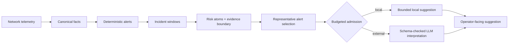

## NetOps Causality Remediation

[](./README.md)
[](./README_CN.md)

This branch studies risk-aware LLM admission for NetOps alert streams. The system does not ask an LLM to decide whether an alert exists. Deterministic rules first produce a fixed alert stream. The post-alert layer then groups alerts into incident windows, builds a bounded evidence view, and decides whether a window should use external LLM interpretation.

The current research question is:

> After deterministic alerting, which incident windows are worth external LLM analysis, and how much risk is introduced when repeated or self-healing windows stay local?

This is an admission and budgeting layer before LLM-based root-cause analysis. It is not a full failure-localization system, not an execution system, and not a claim about diagnosis quality.

## System Flow

The implemented flow has four stages.

1. **Canonical facts.** LCORE-D telemetry is normalized into stable facts with device, fault, path, and metric fields.
2. **Deterministic alerts.** Rule-backed alerting confirms alerts before any model call is considered.
3. **Incident windows.** Alerts are grouped by time, path shape, device spread, and recurrence so repeated alerts are handled as one operational unit.
4. **Risk-aware admission.** Each window is converted into risk atoms and a window-level evidence boundary. A budgeted selector chooses representative alerts for external LLM interpretation; lower-risk windows receive bounded local suggestions.

The local topology view is still active. It is used inside the evidence boundary to define which device, path, timeline, and recurrence cues may be shown to the model.



## Window-Level Evidence Boundary

The evidence boundary is the main post-alert object. It is constructed per incident window and has three surfaces:

| Surface | Purpose |
| --- | --- |
| Selected evidence | Device, path, timeline, recurrence, and local topology cues that may be sent to a model |
| Excluded evidence | Transient, weak, or repeated non-primary alerts that should not dominate the model input |
| Missing evidence | Unavailable device, path, neighbor, or history signals that should be visible during review |

This prevents the model input from becoming either a single under-contextualized alert or a raw dump of nearby telemetry.

## Risk-Aware Admission

Window risk is represented as interpretable risk atoms rather than only a scalar score. Examples include:

- high-value fault evidence
- mixed fault and transient context
- multi-device spread
- recurrence pressure
- topology pressure
- missing path, device, or timeline evidence
- self-healing dominance as a negative offset

The budget controller selects windows by marginal uncovered risk per representative-alert cost:

```text
gain(w | S) = weight(risk_atoms(w) - covered_atoms(S))
priority(w) = gain(w | S) / representative_cost(w)
```

Two budget families are evaluated:

- **Strict coverage budget:** obeys the external-call budget exactly and shows the raw risk-quality tradeoff.
- **Risk budget with safety floor:** keeps high-value windows eligible even when this exceeds the nominal budget.

## Current LCORE-D Results

The full LCORE-D replay contains 6,700 deterministic alerts grouped into 2,929 incident windows.

| Policy | External calls | Call reduction | High-value window recall | Pressure-window skip rate |
| --- | ---: | ---: | ---: | ---: |
| Invoke all | 6,700 | 0.00% | 100.00% | 0.00% |
| Scenario only | 562 | 91.61% | 100.00% | 85.62% |
| Self-healing aware | 6,070 | 9.40% | 100.00% | 14.15% |
| Topology + timeline | 4,588 | 31.52% | 100.00% | 50.80% |
| Window risk tier | 2,983 | 55.48% | 100.00% | 50.61% |
| Strict budget 20% | 586 | 91.25% | 91.94% | 83.60% |
| Risk budget 20% | 586 | 91.25% | 100.00% | 84.21% |

The strict budget curve shows what is lost when the external-call budget is hard. The safety-floor curve shows the cost of retaining all high-value windows. This is the useful comparison: not just fewer calls, but fewer calls with an explicit risk signal.


## Labeling and Calibration

The current labels are weak labels derived from deterministic window structure. They are useful for engineering tests, but they are not a substitute for expert review.

The repository now includes a review workflow:

1. Sample reviewable windows across labels and risk tiers.
2. Fill expert fields for whether the window should invoke an external model, whether the representative alert is sufficient, and whether selected device/path/timeline evidence is covered.
3. Calibrate risk-atom weights to target false-skip rates such as 1%, 5%, or 10%.

The calibration path is intentionally interpretable. It adjusts atom weights and thresholds; it does not replace the admission layer with a black-box model.

## External Validation

An external-validation adapter is provided for RCAEval-style JSONL exports. Its scope is admission-layer transfer: whether the windowing, evidence-boundary, and budgeted-admission logic can be applied to another incident benchmark. It does not evaluate root-cause ranking.

RCAEval should be used after exporting incidents into JSONL with time, service or device, fault type, and optional path or trace identifiers. If no external dataset is present, the adapter fails explicitly instead of fabricating results.

## Relation to LLM RCA Systems

LLM-based RCA systems such as BiAn focus on what happens after an incident has already entered analysis: candidate narrowing, topology and timeline reasoning, and root-cause ranking. This project focuses on the layer before that step. It asks which windows should enter external LLM analysis at all, how many representative alerts are enough, and what risk remains when a window is handled locally.

The two ideas are complementary. A production RCA system can sit behind this admission layer; the admission layer controls budget, context, and serving isolation before the expensive analysis begins.

## Reproducing the Current Evaluation

Run the LCORE-D quality-cost evaluation:

```bash
python3 -m core.benchmark.quality_cost_policy_runner \
  --output-json /data/netops-runtime/LCORE-D/work/quality-cost-policy-runner-frontier-v1.json \
  --output-windows-jsonl /data/netops-runtime/LCORE-D/work/incident-windows-frontier-v1.jsonl \
  --output-labels-jsonl /data/netops-runtime/LCORE-D/work/window-labels-weak-frontier-v1.jsonl
```

Render the paper-style figure:

```bash
python3 -m core.benchmark.quality_cost_frontier_plot \
  --report-json /data/netops-runtime/LCORE-D/work/quality-cost-policy-runner-frontier-v1.json \
  --output-dir documentation/images
```

Sample windows for expert review:

```bash
python3 -m core.benchmark.window_label_sampler \
  --windows-jsonl /data/netops-runtime/LCORE-D/work/incident-windows-frontier-v1.jsonl \
  --output-jsonl /data/netops-runtime/LCORE-D/work/window-label-review-sample-frontier-v1.jsonl \
  --per-label 20
```

Run a weak-label calibration smoke test:

```bash
python3 -m core.benchmark.window_risk_calibration \
  --labels-jsonl /data/netops-runtime/LCORE-D/work/window-labels-weak-frontier-v1.jsonl \
  --allow-weak-labels \
  --output-json /data/netops-runtime/LCORE-D/work/window-risk-calibration-weak-frontier-v1.json
```

## Current NSDI Gap

The system now has the right shape for a systems paper, but the remaining gap is evidence, not wording:

- add expert-reviewed window labels;
- calibrate risk weights against target false-skip rates;
- validate the admission layer on an external benchmark such as RCAEval;
- evaluate recommendation quality only after the admission layer is stable.

Until those are complete, the supported claims are cost control, evidence-boundary construction, serving isolation, and replayability.
