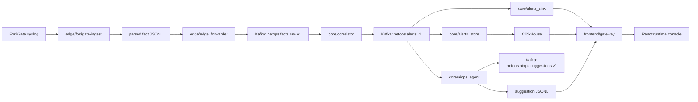

## NetOps Causality Remediation
[](./README.md) [](./README_CN.md)

NetOps Causality Remediation is a deterministic NetOps pipeline with a bounded LLM downstream path. The edge plane ingests real FortiGate syslog, normalizes it into fact JSONL, and forwards it to Kafka. The core plane correlates facts into confirmed alerts, persists the same alert stream into JSONL and ClickHouse, and emits structured AIOps suggestions. The frontend plane reads runtime files through a FastAPI gateway and projects them into a live operator console.

The first decision point remains `core/correlator`. The current LLM path starts after `netops.alerts.v1`. The repository keeps that split explicit in code, tests, and runtime projection.



## Current System

The repository runs three planes. The edge ingestion plane owns rotated file discovery, checkpoint progression, replay semantics, and fact normalization. The core streaming plane owns Kafka transport, deterministic alert confirmation, audit persistence, ClickHouse lookup, alert clustering, and suggestion generation. The runtime projection plane owns snapshot assembly, stream deltas, strategy controls, and the operator-facing console.

`core/aiops_agent` currently supports `alert` and `cluster` scopes. The default provider path is `template`. The downstream reasoning path already carries deterministic runtime seeds and structured reasoning contracts. `reasoning_runtime_seed` contains `candidate_event_graph`, `investigation_session`, `reasoning_trace_seed`, and `runbook_plan_outline`. `evidence_pack_v2` is attached to every evidence bundle and is the stable input object for downstream reasoning. `hypothesis_set` and `review_verdict` are now emitted as first-class suggestion fields. The frontend projector and node inspector can read those structured objects directly.

`core/aiops_agent/alert_reasoning_runtime` is a code package. It does not hold live runtime data. Runtime artifacts stay under `/data/netops-runtime`. The package currently contains deterministic seed builders, session objects, phase routing, runbook outline generation, and trace scaffolding for the downstream reasoning path.

## Runtime Facts

The mounted runtime under `/data/netops-runtime` currently contains `691` alert JSONL files and `201003` alert records from `2026-03-04T15:09:11+00:00` to `2026-04-02T16:23:04+00:00`. It contains `603` suggestion JSONL files and `222023` suggestion records from `2026-03-09T05:08:56.549849+00:00` to `2026-04-05T18:03:18.303384+00:00`. The latest 24 alert partitions contain `1452` `deny_burst_v1|warning` alerts and `1` `bytes_spike_v1|critical` alert. The latest 24 suggestion partitions contain `1690` `alert` suggestions and `32` `cluster` suggestions.

This traffic shape is low QPS. It is enough to validate deterministic correlation, evidence assembly, structured suggestion emission, cluster gating, runtime replay, and bounded post-alert reasoning. It does not justify local large-model hosting on the current core node.

## Reasoning Objects

The current downstream reasoning contract is built around four objects.

`Evidence Pack V2` is attached at `evidence_bundle["evidence_pack_v2"]`. It fixes `direct_evidence`, `supporting_evidence`, `contradictory_evidence`, `missing_evidence`, `freshness`, `source_reliability`, `lineage`, and `summary`. Each evidence entry carries `evidence_id`, `kind`, `status`, `label`, `value`, `source_section`, `source_field`, `source_ref`, and `rationale`.

`HypothesisSet` is built from `InferenceResult` and `Evidence Pack V2`. It fixes `set_id`, `primary_hypothesis_id`, `items`, and `summary`. Each hypothesis item carries `hypothesis_id`, `rank`, `statement`, `confidence_score`, `confidence_label`, `support_evidence_refs`, `contradict_evidence_refs`, `missing_evidence_refs`, `next_best_action`, and `review_state`.

`ReviewVerdict` is built from `Evidence Pack V2`, `HypothesisSet`, and `runbook_plan_outline`. It fixes `verdict_id`, `verdict_status`, `recommended_disposition`, `approval_required`, `blocking_issues`, `checks`, and `review_summary`. `checks` currently cover `evidence_sufficiency`, `temporal_freshness`, `topology_consistency`, `overreach_risk`, `remediation_executability`, and `rollback_readiness`.

`RunbookPlanOutline` is the current structured planning surface. It keeps `prechecks`, `operator_actions`, `approval_boundary`, and `rollback_guidance` attached to the suggestion path without opening any write path.

Phase routing already exists. `hypothesis_generate` reads direct/supporting/contradictory/missing evidence. `hypothesis_critique` reads direct/supporting/contradictory. `runbook_retrieve` and `runbook_draft` reads direct/supporting/missing. `runbook_review` reads direct/contradictory/missing.

## Rule-Based Baseline

The baseline path is fully deterministic from raw fact ingestion to alert confirmation and first-pass suggestion emission. `edge/fortigate-ingest` parses vendor syslog, tracks rotated files, advances checkpoints, preserves source provenance, and emits normalized fact JSONL with stable identifiers and timestamps. `edge/edge_forwarder` forwards those parsed facts to `netops.facts.raw.v1` without adding model inference or open-ended interpretation.

`core/correlator` is the baseline decision engine. It consumes `netops.facts.raw.v1`, applies quality-gate checks, matches rule definitions, aggregates events inside fixed windows, compares metrics against thresholds, and emits `netops.alerts.v1`. The current baseline logic includes explicit rule matching, severity mapping, alert cooldown handling, and deterministic alert payload assembly. The alert object already carries `rule_id`, `severity`, `metrics`, `dimensions`, `event_excerpt`, `topology_context`, `device_profile`, and `change_context`.

`core/alerts_sink` and `core/alerts_store` are also part of the baseline. `core/alerts_sink` writes hourly alert JSONL as the audit surface. `core/alerts_store` writes the same alerts into ClickHouse as the hot query surface for `recent_similar_1h`, recent samples, and bounded history lookup. `core/aiops_agent/cluster_aggregator.py` extends the baseline with same-key repeated-pattern detection. It groups by rule, severity, service, and source device key. It applies `AIOPS_CLUSTER_WINDOW_SEC`, `AIOPS_CLUSTER_MIN_ALERTS`, and `AIOPS_CLUSTER_COOLDOWN_SEC`. It emits a deterministic cluster trigger only when the same-key gate is naturally reached.

The current suggestion path still has a deterministic baseline mode. The `template` provider converts a confirmed alert or confirmed cluster trigger into a bounded suggestion with `summary`, `hypotheses`, `recommended_actions`, `confidence`, and `projection_basis`. This path is deterministic in the sense that it only reads structured alert-side evidence, follows fixed logic branches, and produces stable output for the same input bundle. It does not read raw logs directly. It does not revise whether an alert is valid. It does not open any write path.

The repository therefore already has a clean baseline for comparison. The baseline includes deterministic parsing, deterministic alert confirmation, deterministic history lookup, deterministic cluster gating, deterministic evidence assembly, and deterministic template suggestion generation.

## LLM Enhancement Scope

The LLM path is downstream-only. It starts from a confirmed alert contract or a confirmed cluster trigger. It does not replace `fortigate-ingest`. It does not replace `edge_forwarder`. It does not replace `core/correlator`. It does not decide whether the alert should exist.

The first LLM-oriented enhancement is object normalization. `evidence_bundle` now carries `reasoning_runtime_seed` and `evidence_pack_v2`. `reasoning_runtime_seed` binds the alert to `candidate_event_graph`, `investigation_session`, `reasoning_trace_seed`, and `runbook_plan_outline`. `Evidence Pack V2` turns heterogeneous context into stable evidence groups. `direct_evidence` captures confirmed fields such as `alert.rule_id`, `alert.severity`, `topology.service`, `topology.src_device_key`, `path.path_signature`, and `rule.metrics`. `supporting_evidence` captures bounded history and context attachments such as `history.recent_similar_1h`, `history.cluster_size`, `topology.neighbor_refs`, `history.recent_alert_samples`, `change.change_refs`, `device.known_services`, and `policy.recent_policy_hits`. `contradictory_evidence` records facts that weaken a hypothesis, such as `recent_similar_1h=0`, cluster gate not reached, or no attached change signal. `missing_evidence` records absent fields explicitly instead of leaving them implicit.

The second enhancement is structured reasoning output. `HypothesisSet` turns free-form hypothesis strings into ranked hypothesis items with evidence references, confidence labels, missing evidence references, next-best action pointers, and review state. `ReviewVerdict` turns a free-form suggestion into a bounded review result with explicit checks for evidence sufficiency, temporal freshness, topology consistency, overreach risk, remediation executability, and rollback readiness. These objects are now emitted into the suggestion payload and projected through the gateway into the frontend. The frontend inspector slab and projector no longer need to infer all reasoning state from prose alone.

The third enhancement is stage-aware context control. `phase_context_router.py` now slices `Evidence Pack V2` by stage. Hypothesis generation sees direct, supporting, contradictory, and missing evidence. Critique sees direct, supporting, and contradictory evidence. Runbook retrieval and draft see direct, supporting, and missing evidence. Runbook review sees direct, contradictory, and missing evidence. This keeps each stage bounded to the fields it should use.

The fourth enhancement is future model routing. `provider_routing.py` already emits `compute_target`, `max_parallelism`, `request_kind`, `suggestion_scope`, `candidate_event_graph_id`, `investigation_session_id`, and `runbook_plan_id`. The core node can therefore route selected downstream requests to an external GPU service without changing the deterministic baseline path. If the model path is unavailable, the template provider remains the fallback.

## Baseline vs LLM Comparison Points

The repository now exposes comparison points at multiple layers instead of only comparing final summary text.

Baseline vs LLM evidence layer compares the original evidence bundle against `Evidence Pack V2`. The measurement target is whether direct/supporting/contradictory/missing evidence is explicit, whether source lineage is preserved, and whether missing fields are surfaced as structured gaps.

Baseline vs LLM hypothesis layer compares raw `hypotheses: string[]` against `HypothesisSet`. The measurement target is whether hypotheses are ranked, whether support and contradiction references are attached, whether next-best actions are explicit, and whether the frontend can inspect the current primary hypothesis without re-parsing prose.

Baseline vs LLM review layer compares confidence-only suggestion output against `ReviewVerdict`. The measurement target is whether review checks are explicit, whether blocking issues are surfaced, whether approval is attached as data, and whether the final action surface distinguishes accepted projection from operator-gated projection and return-to-evidence paths.

Baseline vs LLM planning layer compares plain recommended actions against `runbook_plan_outline` and the future structured runbook plan. The measurement target is whether prechecks, approval boundary, rollback guidance, and operator actions are attached as stable fields rather than buried in text.

Baseline vs LLM runtime layer compares one-shot deterministic suggestion generation against a staged downstream reasoning path. The measurement target is whether the system can preserve deterministic alert confirmation while adding typed evidence, typed hypotheses, typed review, and future model-backed planning without changing the upstream alert contract.

## Deployment Boundary

`192.168.1.23` is the edge node. It runs `Intel Xeon E3-1220 v5`, `4` CPU threads, `7.7 GiB` RAM, and `914 GiB` root storage with about `669 GiB` free. This node should stay limited to `fortigate-ingest` and `edge_forwarder`.

`192.168.1.27` is the core node. It runs `Intel Xeon Silver 4310`, `24` CPU threads, `14 GiB` RAM, and `1.8 TiB` root storage with about `1.7 TiB` free. This node hosts Kafka consumers, `core/correlator`, `core/alerts_sink`, `core/alerts_store`, `core/aiops_agent`, and `frontend/gateway`.

The current resource split supports structured evidence assembly, bounded post-alert reasoning, and remote model calls. It does not support hosting a large local model next to Kafka consumers, ClickHouse-backed reads, and the rest of the core services. The repository already reserves remote model access through `AIOPS_PROVIDER=http|gpu_http|external_model_service`, `AIOPS_PROVIDER_ENDPOINT_URL`, `AIOPS_PROVIDER_MODEL`, `AIOPS_PROVIDER_COMPUTE_TARGET`, and `AIOPS_PROVIDER_MAX_PARALLELISM`.

## Verification

```bash
python3 -m pytest -q tests/core
pytest -q tests/frontend/test_runtime_reader_snapshot.py tests/frontend/test_runtime_stream_delta.py
python3 -m compileall -q core edge frontend/gateway
python3 -m core.benchmark.live_runtime_check
cd frontend && npm test
cd frontend && npm run build
```

The current branch also passes focused tests for `Evidence Pack V2`, `HypothesisSet`, `ReviewVerdict`, runtime snapshot projection, and the frontend node inspector/event-field helpers.

## LLM Resource Planning

The next LLM stage should stay post-alert and stay off the two existing nodes. The current runtime produces about `6918.9` alerts/day, `288.29` alerts/hour, and `0.0801` alerts/second over the measured alert window. It produces about `8062.5` suggestions/day, `335.94` suggestions/hour, and `0.0933` suggestions/second over the measured suggestion window. That volume supports a selective reasoning policy. It does not support default long-chain LLM execution on every suggestion.

The edge node should never execute model inference. The core node should continue to build `evidence_bundle`, `evidence_pack_v2`, `hypothesis_set`, `review_verdict`, provider routing hints, and remote requests. It should not host local 14B+ or 30B+ models. Keep `AIOPS_PROVIDER_MAX_PARALLELISM=1` until queue metrics, provider error metrics, and replay traces are all present.

The first external GPU tier should cover compact triage and structured critique. A practical starting point is one remote endpoint in the `24 GiB` to `48 GiB` class for compact reasoning and one stronger endpoint in the `48 GiB` to `80 GiB` class for review and runbook drafting. `triage_compact` requests should stay around `1k-2.5k` input tokens. `hypothesis_critique` should stay around `2.5k-4k`. `runbook_draft` should stay around `3k-5k`. `runbook_review` should stay around `2.5k-4.5k`. Keep stage payloads bounded. Keep serialized evidence packs small. Keep the template provider as the mandatory fallback path.

The next capacity steps should follow this order: keep the current foundation path on `template` plus bounded remote samples, add remote GPU endpoints for selective alert-scope and cluster-scope requests, add request queue metrics and cache keys, then raise concurrency only after timeout rate, queue delay, and replay coverage are observable. If remote GPU is not available and the next experiment actually needs model execution, the fallback is an API-backed provider. That step should be gated by cost and data-handling review, not enabled by default.
