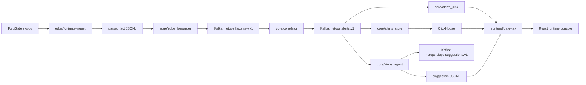

## NetOps Causality Remediation
[](./README.md) [](./README_CN.md)

NetOps Causality Remediation 是一条带受限 LLM 下游路径的确定性 NetOps 主链。边缘平面负责接收真实 FortiGate syslog，解析成结构化 fact JSONL，并转发到 Kafka。核心平面负责把 facts 相关成已成立 alert，把同一批 alert 同时写入 JSONL 和 ClickHouse，再生成结构化 AIOps suggestion。前端平面通过 FastAPI gateway 读取 runtime 文件，把它们投影成实时控制台。

第一判定点仍然是 `core/correlator`。当前 LLM 路径从 `netops.alerts.v1` 之后开始。这个边界在代码、测试和运行时投影里都保持显式。



## 当前系统

仓库当前运行三个平面。边缘采集平面负责轮转文件发现、checkpoint 推进、回放语义和 fact 规范化。核心流式平面负责 Kafka 传输、确定性告警确认、审计持久化、ClickHouse 查询、告警聚簇和 suggestion 生成。运行时投影平面负责 snapshot 组装、流式 delta、策略参数展示和前端控制台。

`core/aiops_agent` 当前支持 `alert` 和 `cluster` 两种 scope。默认 provider 路径是 `template`。下游推理链已经携带结构化 seed 和结构化 reasoning contract。`reasoning_runtime_seed` 当前包含 `candidate_event_graph`、`investigation_session`、`reasoning_trace_seed` 和 `runbook_plan_outline`。`evidence_pack_v2` 已经挂在每个 evidence bundle 上，并作为下游 reasoning 的稳定输入对象。`hypothesis_set` 和 `review_verdict` 已经作为正式字段写入 suggestion。前端 projector 和 node inspector 现在可以直接读取这两个结构化对象。

`core/aiops_agent/alert_reasoning_runtime` 是代码包，不存放运行中的数据。runtime 产物仍然落在 `/data/netops-runtime`。这个包当前保存下游推理路径的 deterministic seed builder、session object、phase router、runbook outline 和 trace scaffold。

## 运行时事实

当前挂载在 `/data/netops-runtime` 下的 runtime 含有 `691` 个 alert JSONL 文件和 `201003` 条 alert，时间范围从 `2026-03-04T15:09:11+00:00` 到 `2026-04-02T16:23:04+00:00`。同一路径下还有 `603` 个 suggestion JSONL 文件和 `222023` 条 suggestion，时间范围从 `2026-03-09T05:08:56.549849+00:00` 到 `2026-04-05T18:03:18.303384+00:00`。最近 24 个 alert 分桶中有 `1452` 条 `deny_burst_v1|warning` 和 `1` 条 `bytes_spike_v1|critical`。最近 24 个 suggestion 分桶中有 `1690` 条 `alert` suggestion 和 `32` 条 `cluster` suggestion。

这组流量形态属于低 QPS。它足够支撑确定性关联、证据组装、结构化 suggestion、cluster gate、runtime replay 和受限的 post-alert reasoning。它不足以支撑在当前核心节点上长期驻留大模型。

## 推理对象

当前下游推理 contract 围绕四个对象组织。

`Evidence Pack V2` 挂在 `evidence_bundle["evidence_pack_v2"]`。它固定 `direct_evidence`、`supporting_evidence`、`contradictory_evidence`、`missing_evidence`、`freshness`、`source_reliability`、`lineage` 和 `summary`。每条 evidence entry 当前带有 `evidence_id`、`kind`、`status`、`label`、`value`、`source_section`、`source_field`、`source_ref` 和 `rationale`。

`HypothesisSet` 从 `InferenceResult` 和 `Evidence Pack V2` 生成。它固定 `set_id`、`primary_hypothesis_id`、`items` 和 `summary`。每条 hypothesis item 当前带有 `hypothesis_id`、`rank`、`statement`、`confidence_score`、`confidence_label`、`support_evidence_refs`、`contradict_evidence_refs`、`missing_evidence_refs`、`next_best_action` 和 `review_state`。

`ReviewVerdict` 从 `Evidence Pack V2`、`HypothesisSet` 和 `runbook_plan_outline` 生成。它固定 `verdict_id`、`verdict_status`、`recommended_disposition`、`approval_required`、`blocking_issues`、`checks` 和 `review_summary`。`checks` 当前覆盖 `evidence_sufficiency`、`temporal_freshness`、`topology_consistency`、`overreach_risk`、`remediation_executability` 和 `rollback_readiness`。

`RunbookPlanOutline` 是当前结构化 planning surface。它保留 `prechecks`、`operator_actions`、`approval_boundary` 和 `rollback_guidance`，但不打开任何写路径。

阶段路由已经存在。`hypothesis_generate` 读取 direct/supporting/contradictory/missing evidence。`hypothesis_critique` 读取 direct/supporting/contradictory。`runbook_retrieve` 和 `runbook_draft` 读取 direct/supporting/missing。`runbook_review` 读取 direct/contradictory/missing。

## Rule-Based 基线

当前 baseline 从原始事实接入到 alert 确认，再到首轮 suggestion 生成，整条链路都是确定性的。`edge/fortigate-ingest` 负责解析厂商 syslog、跟踪轮转文件、推进 checkpoint、保留 source provenance，并生成带稳定标识和时间戳的 fact JSONL。`edge/edge_forwarder` 负责把这些已规范化的 facts 转发到 `netops.facts.raw.v1`，不加入模型推理，也不加入开放式解释。

`core/correlator` 是当前 baseline 的判定引擎。它消费 `netops.facts.raw.v1`，执行 quality gate、规则匹配、固定窗口聚合、阈值比较，并输出 `netops.alerts.v1`。当前 baseline 已经包含显式规则匹配、severity 映射、alert cooldown 和确定性的 alert payload 组装。alert 对象本身已经带有 `rule_id`、`severity`、`metrics`、`dimensions`、`event_excerpt`、`topology_context`、`device_profile` 和 `change_context`。

`core/alerts_sink` 和 `core/alerts_store` 也属于 baseline。`core/alerts_sink` 把 alert 按小时写成 JSONL，作为审计面。`core/alerts_store` 把同一批 alert 写入 ClickHouse，作为 `recent_similar_1h`、recent samples 和受限 history lookup 的热查询面。`core/aiops_agent/cluster_aggregator.py` 则在 baseline 上进一步提供 same-key repeated-pattern 检测。它按 rule、severity、service 和 source device key 分组，应用 `AIOPS_CLUSTER_WINDOW_SEC`、`AIOPS_CLUSTER_MIN_ALERTS` 和 `AIOPS_CLUSTER_COOLDOWN_SEC`，只有在 same-key gate 自然满足时才生成 deterministic cluster trigger。

当前 suggestion 路径本身也保留 deterministic baseline 模式。`template` provider 会把已成立的 alert 或 cluster trigger 转成受限 suggestion，输出 `summary`、`hypotheses`、`recommended_actions`、`confidence` 和 `projection_basis`。这条路径仍然是确定性的，因为它只读取结构化 alert-side evidence，走固定逻辑分支，对同一输入 bundle 会给出稳定输出。它不直接读 raw logs，不回头判断 alert 是否成立，也不打开任何写路径。

因此这个仓库已经具备清晰 baseline。baseline 当前覆盖确定性解析、确定性 alert 确认、确定性 history lookup、确定性 cluster gate、确定性 evidence assembly 和确定性 template suggestion generation。

## LLM 增强范围

LLM 路径当前严格放在 alert downstream。输入是已成立 alert contract 或已成立 cluster trigger。它不替代 `fortigate-ingest`，不替代 `edge_forwarder`，不替代 `core/correlator`，也不负责决定 alert 是否应该存在。

第一层增强是对象规范化。`evidence_bundle` 现在已经带上 `reasoning_runtime_seed` 和 `evidence_pack_v2`。`reasoning_runtime_seed` 把 alert 绑定到 `candidate_event_graph`、`investigation_session`、`reasoning_trace_seed` 和 `runbook_plan_outline`。`Evidence Pack V2` 把异构上下文收束成稳定证据组。`direct_evidence` 当前覆盖 `alert.rule_id`、`alert.severity`、`topology.service`、`topology.src_device_key`、`path.path_signature` 和 `rule.metrics` 这类已确认字段。`supporting_evidence` 当前覆盖 `history.recent_similar_1h`、`history.cluster_size`、`topology.neighbor_refs`、`history.recent_alert_samples`、`change.change_refs`、`device.known_services` 和 `policy.recent_policy_hits` 这类补充上下文。`contradictory_evidence` 记录会削弱假设的事实，比如 `recent_similar_1h=0`、cluster gate 未满足、未挂接 change signal。`missing_evidence` 把缺失字段显式写出来，而不是留给后续阶段自己猜。

第二层增强是结构化 reasoning 输出。`HypothesisSet` 把自由文本 hypothesis 收束成带 rank、evidence refs、confidence label、missing evidence refs、next-best action 和 review state 的结构化假设集。`ReviewVerdict` 把 suggestion 再收束成受边界约束的审查结果，显式检查 evidence sufficiency、temporal freshness、topology consistency、overreach risk、remediation executability 和 rollback readiness。这两个对象现在已经写入 suggestion payload，并通过 gateway 投影到前端。前端 inspector slab 和 projector 不再需要完全依赖 prose 去猜当前 reasoning state。

第三层增强是阶段感知上下文控制。`phase_context_router.py` 现在会按阶段裁剪 `Evidence Pack V2`。hypothesis generation 阶段读取 direct、supporting、contradictory 和 missing evidence。critique 阶段读取 direct、supporting 和 contradictory evidence。runbook retrieval 和 draft 阶段读取 direct、supporting 和 missing evidence。runbook review 阶段读取 direct、contradictory 和 missing evidence。这一步保证每个阶段只看到它应当看到的字段。

第四层增强是未来模型路由。`provider_routing.py` 已经输出 `compute_target`、`max_parallelism`、`request_kind`、`suggestion_scope`、`candidate_event_graph_id`、`investigation_session_id` 和 `runbook_plan_id`。核心节点后续可以把选中的 downstream request 路由到外部 GPU 服务，而不用改动 baseline 主链。如果模型路径不可用，`template provider` 继续作为 fallback。

## Baseline 与 LLM 对比点

当前仓库已经能在多个层级做对比，不再只能比较最终 summary 文本。

Baseline 与 LLM 的 evidence layer 对比，比较对象是原始 evidence bundle 和 `Evidence Pack V2`。观察点是 direct/supporting/contradictory/missing evidence 是否显式、source lineage 是否保留、missing fields 是否作为结构化 gap 暴露。

Baseline 与 LLM 的 hypothesis layer 对比，比较对象是原始 `hypotheses: string[]` 和 `HypothesisSet`。观察点是 hypotheses 是否有 rank、support 和 contradiction refs 是否存在、next-best action 是否显式、前端是否能直接读取 primary hypothesis 而不用重新解析 prose。

Baseline 与 LLM 的 review layer 对比，比较对象是只有 confidence 的 suggestion 输出和 `ReviewVerdict`。观察点是 review checks 是否显式、blocking issues 是否暴露、approval 是否作为数据字段附带、最终 action surface 是否区分 accepted projection、operator-gated projection 和 return-to-evidence。

Baseline 与 LLM 的 planning layer 对比，比较对象是 plain recommended actions 和 `runbook_plan_outline` 以及未来的 structured runbook plan。观察点是 prechecks、approval boundary、rollback guidance 和 operator actions 是否作为稳定字段存在，而不是埋在自由文本里。

Baseline 与 LLM 的 runtime layer 对比，比较对象是 one-shot deterministic suggestion generation 和 staged downstream reasoning path。观察点是系统能否在不改 alert contract 的前提下，增加 typed evidence、typed hypotheses、typed review 和未来 model-backed planning。

## 部署边界

`192.168.1.23` 是边缘节点。配置为 `Intel Xeon E3-1220 v5`、`4` 个 CPU 线程、`7.7 GiB` 内存和 `914 GiB` 根分区，可用空间约 `669 GiB`。这个节点应继续限制在 `fortigate-ingest` 和 `edge_forwarder`。

`192.168.1.27` 是核心节点。配置为 `Intel Xeon Silver 4310`、`24` 个 CPU 线程、`14 GiB` 内存和 `1.8 TiB` 根分区，可用空间约 `1.7 TiB`。这个节点运行 Kafka consumer、`core/correlator`、`core/alerts_sink`、`core/alerts_store`、`core/aiops_agent` 和 `frontend/gateway`。

当前资源拆分适合结构化证据组装、受限的告警下游推理和远端模型调用。它不适合在核心节点上与 Kafka consumer、ClickHouse 查询和其他核心服务并行驻留大模型。仓库已经通过 `AIOPS_PROVIDER=http|gpu_http|external_model_service`、`AIOPS_PROVIDER_ENDPOINT_URL`、`AIOPS_PROVIDER_MODEL`、`AIOPS_PROVIDER_COMPUTE_TARGET` 和 `AIOPS_PROVIDER_MAX_PARALLELISM` 预留远端模型接入。

## 验证

```bash
python3 -m pytest -q tests/core
pytest -q tests/frontend/test_runtime_reader_snapshot.py tests/frontend/test_runtime_stream_delta.py
python3 -m compileall -q core edge frontend/gateway
python3 -m core.benchmark.live_runtime_check
cd frontend && npm test
cd frontend && npm run build
```

当前分支还额外覆盖了 `Evidence Pack V2`、`HypothesisSet`、`ReviewVerdict`、runtime snapshot projection 和前端 node inspector / event-field helper 的聚焦测试。

## 后续 LLM 资源规划

下一阶段的 LLM 路径应继续保持在告警下游，并继续放在现有两台节点之外。按当前 runtime 统计，alert 窗口内平均约 `6918.9` alerts/day、`288.29` alerts/hour、`0.0801` alerts/second。suggestion 窗口内平均约 `8062.5` suggestions/day、`335.94` suggestions/hour、`0.0933` suggestions/second。这组流量支持选择性 reasoning，不支持默认对每条 suggestion 做长链 LLM。

边缘节点不应承载任何模型推理。核心节点应继续负责 `evidence_bundle`、`evidence_pack_v2`、`hypothesis_set`、`review_verdict`、provider routing hint 和远端请求发起。它不应在当前阶段承载本地 14B+ 或 30B+ 模型。`AIOPS_PROVIDER_MAX_PARALLELISM` 在 queue metric、provider error metric 和 replay trace 都补齐之前，应保持为 `1`。

第一层外部 GPU 服务应覆盖 compact triage 和结构化 critique。可行起点是一个 `24 GiB-48 GiB` 级别的 endpoint 负责 compact reasoning，再配一个 `48 GiB-80 GiB` 级别的 endpoint 负责 review 和 runbook drafting。`triage_compact` 输入建议控制在 `1k-2.5k` tokens。`hypothesis_critique` 建议控制在 `2.5k-4k`。`runbook_draft` 建议控制在 `3k-5k`。`runbook_review` 建议控制在 `2.5k-4.5k`。阶段 payload 要继续受限。序列化 evidence pack 要继续保持小体积。`template provider` 必须保留为强制 fallback。

后续容量扩展顺序建议固定为：先保持当前 foundation path 只做 `template + bounded remote samples`，再增加 selective alert-scope 和 cluster-scope 远端请求，再补 request queue metric 和 cache key，最后才提高并发。如果之后真的进入必须跑模型但还没有 GPU 机器的阶段，退路是 API-backed provider。那一步应在成本和数据边界确认后再启用，不应默认打开。
