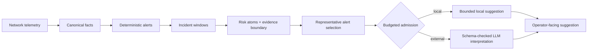

## NetOps Causality Remediation

[](./README.md)
[](./README_CN.md)

当前分支研究的是风险感知的 LLM 调用准入（risk-aware LLM admission）。系统不让大模型判断告警是否成立。确定性规则先产生固定告警流（fixed deterministic alert stream），告警之后的层再把告警聚成事故窗口（incident windows）、构造边界受控的证据视图（evidence boundary），并决定哪些窗口值得进入外部 LLM 分析。

当前研究问题是：

> 确定性告警之后，哪些事故窗口值得外部 LLM 分析；当重复或自愈窗口留在本地路径时，系统引入了多少风险？

这是一层位于 LLM 根因分析（LLM-based RCA）之前的准入与预算控制（admission and budgeting layer）。它不是完整故障定位系统，不是自动修复系统，也不主张生产级诊断准确率。

## 系统流程

系统当前有四个主要阶段。

1. **规范事实（canonical facts）。** LCORE-D 遥测被归一化成包含设备、故障、路径和指标字段的稳定事实。
2. **确定性告警（deterministic alerts）。** 规则先确认告警，模型不参与告警成立。
3. **事故窗口（incident windows）。** 系统按时间、路径形状、设备扩散和重复压力聚合告警，避免每条重复告警都触发一次外部推理。
4. **风险感知准入（risk-aware admission）。** 每个窗口被转换成风险原子（risk atoms）和窗口级证据边界（window-level evidence boundary）。预算选择器在外部调用预算下选择窗口和代表告警；低风险窗口返回本地有界建议。

之前的局部拓扑视图（local topology view）没有废掉。它现在位于证据边界内部，用来定义哪些设备、路径、时间线和重复信号可以给模型看。



## 窗口级证据边界

证据边界是告警之后的核心对象。每个事故窗口都有三个证据面：

| 证据面 | 作用 |
| --- | --- |
| 选中证据（selected evidence） | 可以发送给模型的设备、路径、时间线、重复信号和局部拓扑线索 |
| 排除证据（excluded evidence） | 不应主导模型输入的 transient、弱相关或重复非主告警 |
| 缺失证据（missing evidence） | 审查时必须可见的缺失设备、路径、邻居或历史信号 |

这个边界避免两种极端：只给模型一条上下文不足的告警，或者把附近所有遥测原样倒给模型。

## 风险感知准入

窗口风险不再只是一个分数，而是由可解释的风险原子组成。当前风险原子包括：

- 高价值故障证据（high-value fault evidence）
- 故障与 transient 混合上下文（mixed fault and transient context）
- 多设备扩散（multi-device spread）
- 重复压力（recurrence pressure）
- 拓扑压力（topology pressure）
- 设备、路径或时间线缺失证据（missing evidence）
- 自愈主导窗口的负向修正（self-healing dominance）

预算控制器按“未覆盖风险收益 / 代表告警成本”选择窗口：

```text
gain(w | S) = weight(risk_atoms(w) - covered_atoms(S))
priority(w) = gain(w | S) / representative_cost(w)
```

当前评估两类预算策略：

- **严格覆盖预算（strict coverage budget）：** 严格遵守外部调用预算，用来暴露原始风险-质量权衡。
- **带安全保底的风险预算（risk budget with safety floor）：** 即使超过名义预算，也保留高价值窗口。

## 当前 LCORE-D 结果

完整 LCORE-D replay 包含 6,700 条确定性告警，被聚成 2,929 个事故窗口。

| 策略 | 外部调用 | 调用减少 | 高价值窗口召回 | 压力窗口跳过率 |
| --- | ---: | ---: | ---: | ---: |
| Invoke all | 6,700 | 0.00% | 100.00% | 0.00% |
| Scenario only | 562 | 91.61% | 100.00% | 85.62% |
| Self-healing aware | 6,070 | 9.40% | 100.00% | 14.15% |
| Topology + timeline | 4,588 | 31.52% | 100.00% | 50.80% |
| Window risk tier | 2,983 | 55.48% | 100.00% | 50.61% |
| Strict budget 20% | 586 | 91.25% | 91.94% | 83.60% |
| Risk budget 20% | 586 | 91.25% | 100.00% | 84.21% |

严格预算曲线说明硬预算会牺牲哪些窗口；安全保底曲线说明保留所有高价值窗口需要付出多少调用成本。这个对比比单独报告“减少了多少调用”更有意义。


## 标注与校准

当前标签仍然是弱标签（weak labels），由确定性窗口结构生成。它们可以用于工程测试，但不能替代专家复核。

当前已经有可运行的复核流程：

1. 按窗口标签和风险层级采样待复核窗口。
2. 人工填写窗口是否应该外部调用、代表告警是否足够、设备/路径/时间线证据是否覆盖。
3. 用复核结果校准风险原子权重，把阈值调到目标误跳过率，例如 1%、5% 或 10%。

校准路径保持可解释：它调整风险原子权重和阈值，不把准入层替换成黑盒模型。

## 外部验证

当前提供了 RCAEval 风格 JSONL 的外部验证适配器。它验证的是准入层迁移能力：窗口构造、证据边界和预算准入是否能应用到另一个事故 benchmark。它不声称根因定位准确率。

使用 RCAEval 时，需要先把事故导出成包含时间、服务或设备、故障类型、可选路径或 trace 标识的 JSONL。没有外部数据时，适配器会直接失败，不会伪造结果。

## 与 BiAn 类系统的关系

BiAn 这类 LLM RCA 系统关注的是事故进入分析之后如何做候选收缩、拓扑/时间线推理和根因排序。本项目关注它之前的一层：哪些窗口应该进入外部 LLM 分析、一个窗口需要多少代表告警、窗口留在本地时残留多少风险。

两者不是正面竞争关系。BiAn 类系统可以放在本准入层之后；本准入层负责在昂贵分析开始之前控制预算、上下文和服务隔离。

## 复现实验

运行 LCORE-D 质量-成本评估：

```bash
python3 -m core.benchmark.quality_cost_policy_runner \
  --output-json /data/netops-runtime/LCORE-D/work/quality-cost-policy-runner-frontier-v1.json \
  --output-windows-jsonl /data/netops-runtime/LCORE-D/work/incident-windows-frontier-v1.jsonl \
  --output-labels-jsonl /data/netops-runtime/LCORE-D/work/window-labels-weak-frontier-v1.jsonl
```

生成论文级 PNG/PDF 图：

```bash
python3 -m core.benchmark.quality_cost_frontier_plot \
  --report-json /data/netops-runtime/LCORE-D/work/quality-cost-policy-runner-frontier-v1.json \
  --output-dir documentation/images
```

采样专家复核窗口：

```bash
python3 -m core.benchmark.window_label_sampler \
  --windows-jsonl /data/netops-runtime/LCORE-D/work/incident-windows-frontier-v1.jsonl \
  --output-jsonl /data/netops-runtime/LCORE-D/work/window-label-review-sample-frontier-v1.jsonl \
  --per-label 20
```

用弱标签跑校准 smoke test：

```bash
python3 -m core.benchmark.window_risk_calibration \
  --labels-jsonl /data/netops-runtime/LCORE-D/work/window-labels-weak-frontier-v1.jsonl \
  --allow-weak-labels \
  --output-json /data/netops-runtime/LCORE-D/work/window-risk-calibration-weak-frontier-v1.json
```

## 当前 NSDI 缺口

系统形态已经接近一篇 systems paper 需要的主线，但剩下的问题是证据，不是修辞：

- 补专家复核窗口标签；
- 用目标误跳过率校准风险权重；
- 在 RCAEval 等外部 benchmark 上验证准入层迁移；
- 准入层稳定后，再评估模型建议质量。

在这些完成之前，当前能稳妥支撑的 claim 是成本控制、证据边界、服务隔离和可回放性。
