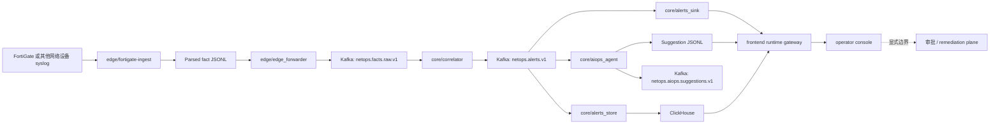
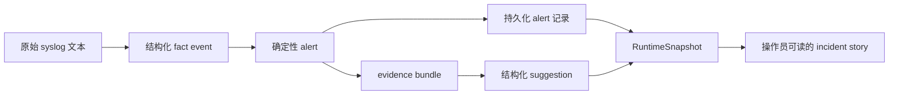

## Towards NetOps：Hybrid AIOps 驱动的网络感知与运维辅助平台
[](./README.md) [](./README_CN.md)

> Hybrid AIOps Platform: Deterministic Streaming Core + CPU Local LLM (On-Demand) + Multi-Agent Orchestration

#### 这个仓库到底在做什么

这个仓库不是单纯做一个“会说话的 AIOps demo”，而是按下面这个顺序搭系统：

1. 先把原始设备日志变成结构化、可回放、可审计的事实对象
2. 再用确定性流式规则做第一轮系统级判断
3. 再把 alert 持久化成审计面和热查询面
4. 最后才允许模型增强在 alert contract 之上工作
5. 前端必须把整条链路和控制边界说明白，而不是伪装成已经能安全执行

这就是整个架构的核心。
这个仓库不是为了证明“LLM 能不能对网络日志说点像样的话”，而是为了证明真实网络运行时能不能先被收束成稳定数据面，然后再在不破坏实时链路的前提下，叠加有边界的 AIOps 增强。

## 系统拓扑



这张图表达的是：

- `edge/fortigate-ingest` 把厂商 syslog 变成有 replay 语义的结构化事实
- `edge/edge_forwarder` 把事实对象送进共享流式通道
- `core/correlator` 负责确定性判断并产出 alert
- `core/alerts_sink` 留审计轨迹
- `core/alerts_store` 留热查询上下文
- `core/aiops_agent` 把 alert 变成 evidence-backed suggestion
- `frontend/gateway` 把这些运行态产物投影成只读控制台

## 端到端数据流

最容易理解这个仓库的方法，不是背模块名，而是跟着“对象”走一遍。



同一条事件在系统里会经历几次“语义升级”：

| 阶段 | 数据对象 | 生产者 | 为什么需要这一层 |
| --- | --- | --- | --- |
| 源头 | FortiGate 原始 syslog 行 | 设备 / 网关 | 带着原始网络语义，但还是厂商文本格式 |
| Edge fact | 结构化 JSONL 事实事件 | `edge/fortigate-ingest` | 标准化时间、身份、来源元数据和 replay 语义 |
| 共享传输 | Kafka fact record | `edge/edge_forwarder` | 把 edge 本地文件处理和 core 分析解耦 |
| Alert | 结构化 alert contract | `core/correlator` | 第一次把“有流量事件”升级成“系统确认有告警” |
| 审计/查询产物 | JSONL + ClickHouse alert record | `core/alerts_sink`, `core/alerts_store` | 同时满足证据保留和热查询装配 |
| Suggestion 输入 | evidence bundle + context | `core/aiops_agent` | 把 alert、拓扑、设备、历史上下文压缩成受控推理对象 |
| Suggestion 输出 | 结构化 suggestion record | `core/aiops_agent` | 输出操作员能读的摘要、置信度、假设和下一步动作 |
| UI 视图 | `RuntimeSnapshot` | `frontend/gateway` | 把整条链路作为一个 incident story 投影给前端 |

## 系统到底产出什么数据，以及这些数据的意义

### 1. Structured Fact Events

边缘层不是“盯文件然后原样往后转”。
它必须先把设备日志变成 downstream 可以信任的事实对象。

事实对象这一层至少要保证：

- 保留源文件路径、inode、offset 这种 provenance
- 把原始时间收束成可排序的 `event_ts`
- 生成稳定的 `src_device_key`，让后续能围绕设备聚合
- 保留 `kv_subset` 作为紧凑回溯桥，避免每次调试都回到原始日志

完整字段表放在：

- [FortiGate 原始输入字段分析](./documentation/FORTIGATE_INPUT_FIELD_ANALYSIS.md)
- [FortiGate parsed JSONL 输出样例](./documentation/FORTIGATE_PARSED_OUTPUT_SAMPLE.md)

### 2. Deterministic Alerts

alert 是这个仓库里第一个真正的“incident contract”。
它代表系统第一次正式做出判断：这不再只是一个原始流量事件，而是一次规则或阈值命中的告警。

当前挂载 runtime 里的一条 alert 样例如下：

```json
{
  "alert_id": "2081f46a5146d642d4110253926698c1b8b6fced",
  "alert_ts": "2026-03-26T18:56:04+00:00",
  "rule_id": "deny_burst_v1",
  "severity": "warning",
  "metrics": { "deny_count": 321, "window_sec": 60, "threshold": 200 },
  "event_excerpt": {
    "action": "deny",
    "srcip": "5.188.206.46",
    "dstip": "77.236.99.125",
    "service": "tcp/3472"
  },
  "topology_context": {
    "service": "tcp/3472",
    "srcintf": "wan1",
    "dstintf": "unknown0",
    "zone": "wan"
  }
}
```

这层数据的意义很直接：

- `metrics` 说明告警为什么成立
- `event_excerpt` 保留局部 incident 形状
- `topology_context`、`device_profile`、`change_context` 让后续 investigation 不再只是看一个规则名

### 3. 持久化 Alert 产物

同一条 alert 要落两次，不是冗余设计，而是因为这两层用途完全不同。

| 产物 | 路径 / 系统 | 意义 |
| --- | --- | --- |
| Alert JSONL | `/data/netops-runtime/alerts/alerts-*.jsonl` | 审计轨迹、回放、保留原始 emitted record |
| Alert 表记录 | `core/alerts_store` 写入 ClickHouse | 支撑近历史检索、相似告警查询、上下文装配 |

所以 JSONL 和 ClickHouse 不是“重复存一下”。
JSONL 是证据面。
ClickHouse 是检索面。

### 4. Structured Suggestions

suggestion 不是一段自由聊天文本，而是 alert 下游的结构化运行时产物。

当前挂载 runtime 里的一条 suggestion 样例如下：

```json
{
  "suggestion_id": "598b2edba0f164f9a0048e8d6021974123d1927c",
  "suggestion_ts": "2026-03-31T15:35:49.119215+00:00",
  "suggestion_scope": "alert",
  "alert_id": "2081f46a5146d642d4110253926698c1b8b6fced",
  "rule_id": "deny_burst_v1",
  "priority": "P2",
  "summary": "deny_burst_v1 triggered for service=tcp/3472 device=5.188.206.46",
  "context": {
    "service": "tcp/3472",
    "src_device_key": "5.188.206.46",
    "recent_similar_1h": 0,
    "provider": "template"
  }
}
```

这层产物的意义是：

- suggestion 仍然明确指回某条 alert
- 它没有替代检测链，而是在 alert 已成立后补解释和下一步动作
- 输出 schema 稳定，包含 summary、priority、hypotheses、recommended actions 等操作员可消费信息

## 各个组件是怎么联系起来流动的

理解这个仓库最好的方式，是把每个组件放进它前后相邻的数据关系里讲。

### Edge 层

#### `edge/fortigate-ingest`

这是厂商设备现实和系统事实对象之间的第一道边界。

它负责：

- 扫描 active / rotated FortiGate 日志文件
- 维护 checkpoint 与 replay 语义
- 解析 syslog + FortiGate key-value payload
- 按小时写出 parsed facts
- 保留故障恢复和审计所需的 provenance

它不负责判断 incident 是否成立。
它只负责把原始日志变成一个后续系统可以安全消费的事实对象。

#### `edge/edge_forwarder`

这个组件存在的原因，是把“文件处理语义”和“共享传输语义”切开。

它负责：

- 读取 parsed JSONL facts
- 转发到 `netops.facts.raw.v1`
- 不重解释事件，只做 transport handoff

如果没有这一层，core 会被迫继承 edge 本地文件处理逻辑。

### Core 层

#### `core/correlator`

这是实时判定点。

它负责：

- 消费 `netops.facts.raw.v1`
- 做 quality gate
- 跑确定性规则和滑窗聚合
- 输出 `netops.alerts.v1`

这也是仓库里最重要的架构线：
第一次“系统确认有告警”这件事必须保持确定性。
只有这样，整条链路才能继续保持可回放、可审计、可调优。

#### `core/alerts_sink`

这是 alert 流的长审计记忆。

它负责：

- 消费 `netops.alerts.v1`
- 按小时落 JSONL
- 保留 alert 在运行时真正被发出的样子

这样仓库讨论 alert 历史时，依赖的是 runtime artifact，而不是会变化的图表快照。

#### `core/alerts_store`

这是热查询面。

它负责：

- 消费 `netops.alerts.v1`
- 把 alert 写入 ClickHouse
- 支撑 recent-similar lookup、历史检索和 suggestion 的上下文装配

没有它，历史查询基本都会退化成扫文件。

#### `core/aiops_agent`

这是当前的 bounded augmentation layer。

它负责：

- 从 alert 开始，而不是从 raw logs 开始
- 组装 alert、history、topology、device、change context
- 同时支持 alert-scope 和 cluster-scope suggestion
- 把 suggestion 继续落盘，保留审计轨迹

它不是 correlator 的替代品。
它的职责是在 alert 已经成立之后，补出证据组织、总结和下一步建议。

### Frontend 与 Projection 层

#### `frontend/gateway`

网关是 projection builder，不是 system of record。

它负责：

- 读取 alert JSONL、suggestion JSONL 和 deployment controls
- 组装 `RuntimeSnapshot`
- 用 `SSE` 把变化推给前端

这样前端不会凭空再造一套“真相模型”，而是尽量贴近 runtime artifact 本身。

#### `frontend`

React 控制台不是 panel-first，而是 process-first。

它应该回答的问题是：

- 当前 incident 在链路的哪一段已经显形
- 现在哪些 evidence 已经具备，哪些还缺
- 系统推断了什么，它是从哪条 alert 和哪份 context 推出来的
- 解释边界在哪里结束，控制边界从哪里开始

重要的不是页面能不能渲染，而是页面能不能把系统边界讲明白。

## 当前挂载 Runtime 的真实数据

下面这些数字都来自当前工作区挂载的 `/data/netops-runtime`。

| 运行切片 | 当前事实 |
| --- | --- |
| Alert sink 覆盖范围 | `554` 个小时文件，累计 `152,481` 条 alert |
| Alert sink 时间范围 | `2026-03-04T15:09:11+00:00` 到 `2026-03-27T23:00:17+00:00` |
| Suggestion sink 覆盖范围 | `480` 个小时文件 |
| Suggestion sink 时间范围 | `2026-03-09T05:08:56.549849+00:00` 到 `2026-03-31T15:36:55.895982+00:00` |
| 最新 6 个 alert 分桶 | `504` 条 alert，覆盖 `2026-03-27T18:00:14+00:00` 到 `2026-03-27T23:00:17+00:00` |
| 最新 6 个 suggestion 分桶 | `3,703` 条 suggestion，覆盖 `2026-03-31T10:00:16.165096+00:00` 到 `2026-03-31T15:36:55.895982+00:00` |
| 最近 24 个 alert 分桶 | `warning=2067`，`critical=2` |
| 最近 24 个 alert rule | `deny_burst_v1=2067`，`bytes_spike_v1=2` |
| 最近 24 个 suggestion scope | `alert=9058`，`cluster=1353` |
| 最近 24 个 suggestion provider | `template=10411` |

这里有一个必须说清楚的事实：
当前挂载 runtime 不是一份时间完全对齐的 live snapshot。
最新 suggestion 记录大多仍在引用 3 月 26 日的 alert 上下文，而最新 alert 文件停在 3 月 27 日。
所以这份数据可以证明仓库的输出产物链路是持续存在的，但不能写成“所有层现在严格同步地 live 在跑”。

## 这些最终产物对操作员意味着什么

到了控制台这一层，系统其实已经把一条设备日志变成了四层不同语义的产物：

| 产物 | 对操作员的意义 |
| --- | --- |
| Raw-derived fact | 这条事件真实发生过，而且可以追溯来源 |
| Deterministic alert | 系统可以明确解释它为什么跨过了规则或阈值 |
| Evidence bundle | 这条 alert 已经带上了足够做 investigation 的上下文 |
| Suggestion | 系统可以总结什么最值得下一步看，但没有假装自己已经执行 |

这也是为什么前端要把 remediation boundary 显式画出来。
这个系统已经能解释 incident path，但还没有资格把自己说成安全闭环执行系统。

## 已落地范围与显式边界

已经落地的部分：

- replay-aware FortiGate ingest
- 结构化 facts 进入 Kafka
- 确定性 alerting
- alert 审计 JSONL
- ClickHouse 热告警检索
- alert-scope 和 cluster-scope 的 bounded suggestion
- 只读 runtime console 和薄网关

明确还不在当前已交付路径里的部分：

- 设备写回
- 审批驱动执行
- 自动 remediation
- 全量事件流模型判定
- “当前 UI 已经是闭环控制平面”这种说法

## 验证入口

```bash
python3 -m pytest -q tests/core
pytest -q tests/frontend/test_runtime_reader_snapshot.py tests/frontend/test_runtime_stream_delta.py
python3 -m compileall -q core edge frontend/gateway
python3 -m core.benchmark.live_runtime_check
cd frontend && npm run build
```

当前测试采集基线：

- `tests/core` 加上两个 runtime console 测试，一共 `33` 个测试

## 更详细的文档

- [当前项目状态](./documentation/PROJECT_STATE_CN.md)
- [受控验证记录](./documentation/CONTROLLED_VALIDATION_20260322.md)
- [前端 runtime 架构](./documentation/FRONTEND_RUNTIME_ARCHITECTURE_20260328_CN.md)
- [Edge 运行指南](./documentation/EDGE_RUNTIME_GUIDE.md)
- [Core 运行指南](./documentation/CORE_RUNTIME_GUIDE.md)
- [Frontend 工作区指南](./documentation/FRONTEND_WORKSPACE_GUIDE.md)
- [FortiGate 原始输入字段分析](./documentation/FORTIGATE_INPUT_FIELD_ANALYSIS.md)
- [FortiGate parsed JSONL 输出样例](./documentation/FORTIGATE_PARSED_OUTPUT_SAMPLE.md)
- [FortiGate 接入字段参考](./documentation/FORTIGATE_INGEST_FIELD_REFERENCE_CN.md)
