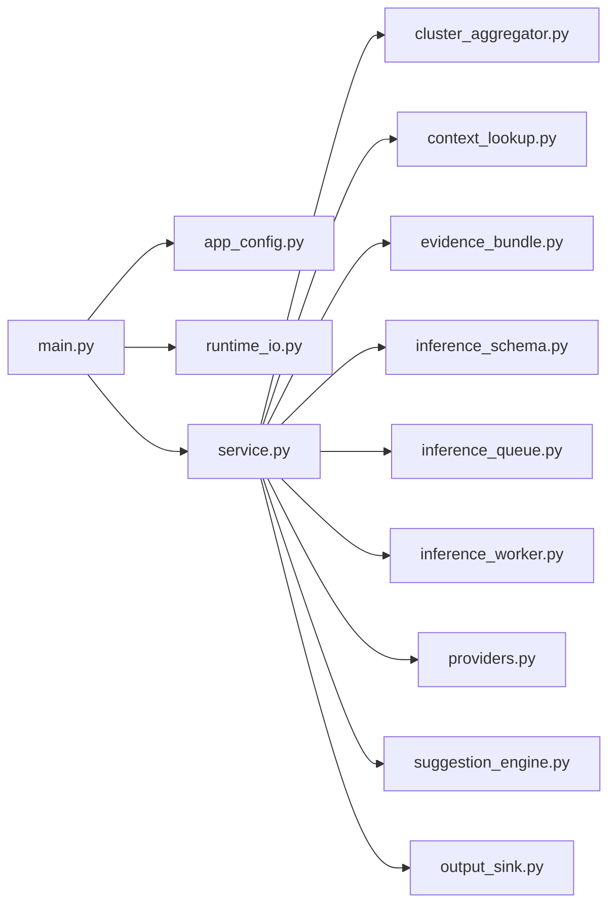

# Core Runtime Guide / Core 运行指南

This note replaces the old `core/README*.md`, `core/MODULE_INDEX.md`, and `core/automatic_scripts/README.md`.

这份文档接管原来的 `core/README*.md`、`core/MODULE_INDEX.md` 和 `core/automatic_scripts/README.md`，把 core 侧说明统一收口到 `documentation/`。

## Scope / 范围

The core side is the deterministic data plane plus bounded AIOps augmentation layer.

It is responsible for:

- consuming fact events from Kafka
- producing deterministic alerts
- persisting alerts to audit and hot-query surfaces
- generating bounded suggestions from alert context
- exposing benchmark and runtime validation entry points

core 侧负责：

- 从 Kafka 消费 fact events
- 产出确定性 alert
- 同时把 alert 落到审计面和热查询面
- 在 alert context 之上生成 bounded suggestion
- 提供 benchmark 和 runtime validation 入口

## Runtime Modules / 运行模块

| Path | Responsibility |
| --- | --- |
| `core/correlator` | consume `netops.facts.raw.v1`, apply quality gate + rules, emit `netops.alerts.v1` |
| `core/alerts_sink` | consume alerts and persist hourly JSONL |
| `core/alerts_store` | consume alerts and write structured rows into ClickHouse |
| `core/aiops_agent` | consume alerts, build evidence bundles, emit structured suggestions |
| `core/benchmark` | throughput probes, replay validation, runtime watch, timestamp audit |
| `core/deployments` | namespace, Kafka, topic init, correlator, ClickHouse, alerts store, aiops manifests |
| `core/docker` | image build files |
| `common/infra` | shared config/logging/checkpoint helpers |

## Data Plane Topics / 数据平面 Topic

- `netops.facts.raw.v1`
- `netops.alerts.v1`
- `netops.dlq.v1`
- `netops.aiops.suggestions.v1`

## AIOps Agent Internal Design / AIOps Agent 内部结构



Key internal responsibilities / 关键内部职责：

- `cluster_aggregator.py`: same-key alert-window clustering and cooldown handling
- `context_lookup.py`: recent-similar retrieval from ClickHouse
- `evidence_bundle.py`: build alert-scope and cluster-scope evidence objects
- `providers.py`: provider abstraction for `template` and future HTTP / local model backends
- `service.py`: main loop, publish semantics, commit semantics
- `output_sink.py`: suggestion JSONL persistence

## Current Important Envs / 当前关键环境变量

- `AIOPS_CLUSTER_WINDOW_SEC`
- `AIOPS_CLUSTER_MIN_ALERTS`
- `AIOPS_CLUSTER_COOLDOWN_SEC`
- `AIOPS_PROVIDER`
- `AIOPS_PROVIDER_ENDPOINT_URL`
- `AIOPS_PROVIDER_MODEL`

## Build / 构建

```bash
docker build -t netops-core-app:0.1 -f core/docker/Dockerfile.app .
```

## Deploy Order / 部署顺序

```bash
kubectl apply -f core/deployments/00-namespace.yaml
kubectl apply -f core/deployments/10-kafka-kraft.yaml
kubectl apply -f core/deployments/20-topic-init-job.yaml
kubectl apply -f core/deployments/40-core-correlator.yaml
kubectl apply -f core/deployments/50-core-alerts-sink.yaml
kubectl apply -f core/deployments/60-clickhouse.yaml
kubectl apply -f core/deployments/70-core-alerts-store.yaml
kubectl apply -f core/deployments/80-core-aiops-agent.yaml
```

## Validation And Benchmark Entry Points / 验证与观测入口

```bash
python -m core.benchmark.kafka_load_producer --help
python -m core.benchmark.kafka_topic_probe --help
python -m core.benchmark.alerts_quality_observer --help
python -m core.benchmark.pipeline_watch --help
python -m core.benchmark.runtime_timestamp_audit --help
python -m core.benchmark.live_runtime_check
```

## Release Automation / 发布自动化

```bash
./core/automatic_scripts/release_core_app.sh
```

What the script does / 脚本做什么：

1. build `netops-core-app`
2. save/import the image into the local core runtime
3. update core deployment images
4. wait for rollout
5. run in-pod import checks
6. verify final deployment image tags

## Reliability Notes / 可靠性说明

- core consumers use manual offset commit after successful handling
- malformed or failed records may enter `netops.dlq.v1`
- runtime observability is still log-first and artifact-first
- rule thresholds can be versioned in profiles and overridden by emergency envs
- ClickHouse is hot query storage, not the raw source of truth

## Related Docs / 相关文档

- [Current project state](./PROJECT_STATE.md)
- [Controlled validation](./CONTROLLED_VALIDATION_20260322.md)
- [Live demo packet](./LIVE_DEMO_FAULT_INJECTION_AUTO_LOCALIZATION.md)
