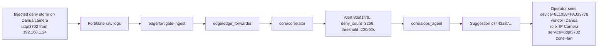

# Live Demo: Fault Injection -> Automatic Localization

This packet is meant for temporary walkthroughs, screen recordings, or in-person demos.
It is not a fictional marketing storyboard. The incident shape is derived from real runtime artifacts already present under `/data/netops-runtime`.

## Demo Goal

Show one compact story:

1. a device starts producing abnormal deny traffic
2. the deterministic pipeline catches it without any model in the hot path
3. the AIOps layer turns the alert into a localized, operator-readable explanation
4. the operator immediately sees which device, which service, which path, and what to check next

## Runtime-Derived Source Artifacts

This demo packet is built from these concrete artifacts:

- Alert sample:
  - `/data/netops-runtime/alerts/alerts-20260325-11.jsonl`
  - `alert_id=8daf1f7935555d30ec5b5de23cbd15ad467dccde`
- Suggestion sample:
  - `/data/netops-runtime/aiops/suggestions-20260329-11.jsonl`
  - `suggestion_id=c7443287ce5d6881d6f34b86a100ee2e0d352fa9`
- Replay / cluster validation:
  - `/data/netops-runtime/observability/aiops-replay-validation-20260322-window600.json`

The presentation timeline below is compressed for demo clarity.
The alert fields, device profile, topology context, change context, and recommendation content all come from real repository runtime history.

## Demo Incident

| Item | Value |
| --- | --- |
| Rule | `deny_burst_v1` |
| Service | `udp/3702` |
| Device key | `3c:e3:6b:77:82:89` |
| Device name | `8L10584PAJ33778` |
| Vendor / role | `Dahua / IP Camera` |
| Source IP | `192.168.1.24` |
| Destination IP | `192.168.2.108` |
| Zone | `lan` |
| Deterministic threshold | `200 denies / 60s` |
| Observed deny count | `3256` |
| Recent similar alerts | `284 in 1h` |
| Change signal | `suspected_change=true`, `score=30`, `level=high` |
| Confidence | `0.78 / medium` |

## One-Page Flow

## Presenter Script

### 30-second version

"We intentionally trigger a short deny burst from a Dahua IP camera. The model does not sit in front of the stream. First, the deterministic correlator proves the rule was crossed: 3256 denies in 60 seconds against a 200 threshold. Then the AIOps layer assembles context that already exists in the system: source IP, destination IP, device profile, recent recurrence, and change markers. The operator does not just get `deny_burst_v1`; they get the actual affected device, service, path, and next actions."

### 90-second version

1. "The injected fault is simple: the camera starts generating repeated denied `udp/3702` traffic."
2. "The first important point is that the hot path stays deterministic. `core/correlator` emits the alert because the rule crossed `200 / 60s`; no model is needed to prove the anomaly exists."
3. "The second point is localization. The evidence bundle ties the alert to `3c:e3:6b:77:82:89`, resolves it to device `8L10584PAJ33778`, identifies it as a `Dahua IP Camera`, and keeps the exact network path `192.168.1.24 -> 192.168.2.108` in the same record."
4. "The third point is operator usability. The suggestion is no longer a raw rule string. It tells the responder what to inspect next: session trace, recent deny history, and whether this service is expected for this device profile and path."
5. "If the same pattern repeats across the cluster gate, the exact same pipeline can escalate from alert-scope explanation to cluster-scope meaning without moving the model into the raw stream."

## Demo Sequence

| Demo beat | What to say | What the audience should see |
| --- | --- | --- |
| Fault injected | "We force a short deny storm from one camera." | One active incident appears for `udp/3702` on a single device |
| Deterministic alert | "The rule crosses `200 / 60s` and emits an alert." | `deny_count=3256`, severity `warning`, rule `deny_burst_v1` |
| Automatic localization | "The system now tells us which device and path are involved." | `Dahua / IP Camera / 8L10584PAJ33778 / 192.168.1.24 -> 192.168.2.108 / lan` |
| Context enrichment | "This is not a naked alert. It already knows recent recurrence and change risk." | `recent_similar_1h=284`, `suspected_change=true`, `level=high` |
| Next action | "The output is already operator-readable." | Recommended actions appear in natural language |

## What Makes This Demo Strong

- The anomaly proof is deterministic.
- The localization is evidence-backed.
- The explanation is short enough for a live audience.
- The same story can be shown in the UI, in JSON, or in logs.
- It demonstrates why the project is not "LLM over every log line."

## Optional Escalation Beat

If you want a second scene after the single-incident story, add a cluster replay beat:

- Source artifact:
  - `/data/netops-runtime/observability/aiops-replay-validation-20260322-window600.json`
- Useful talking point:
  - `deny_burst_v1` produced `12751` cluster triggers in the replay window
  - the top repeated service was `udp/3702`

That gives you a clean transition:

- scene 1: "one injected fault is localized to one device"
- scene 2: "repeated similar faults become cluster-legible without redesigning the pipeline"

## Companion Fixture

The companion front-end ready fixture lives at:

- `frontend/fixtures/demo/fault-injection-auto-localization.json`

Use that file if you want the UI to render this exact story without depending on live data freshness.
